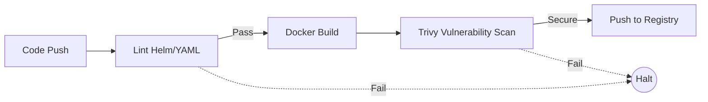

# 01 Pipeline Design

## Metadata
- Duration: `15 minutes`
- Difficulty: `Beginner`
- Practical/Theory: `30/70`
- Tested on Kubernetes: `v1.30`

## Learning Objective
By the end of this lesson, you will be able to:
- Identify the core stages of a secure Continuous Integration (CI) pipeline.
- Verify container payloads against structural and security thresholds before they ever touch a cluster.

## Why This Matters in Real Jobs
If you build container images manually on your laptop and push them to production, you are a security breach waiting to happen. In the enterprise, nobody deploys locally. Code must pass automated Linting, Building, and Vulnerability Scanning (CVE checks) inside a structured pipeline before it is certified for release.

## Concepts (Short Theory)
- **Lint:** Checking Helm charts or Kustomize files for syntax errors without deploying them.
- **Build:** Compiling code and packaging it rigidly inside a Docker container.
- **Scan:** Utilizing security tools (like Trivy or Grype) to check the generated image for known hacks or vulnerabilities.
- **Publish:** Pushing the certified image rigidly to a central registry (Harbor, ECR, GCR).

## Visual: CI Workflow



## Lab: Step-by-Step Practical

### Step 1 - Open directory
**Run:**
```bash
cd "$COURSE_DIR/04-CICD-and-GitOps/01-pipeline-design"
```

### Step 2 - Inspect the CI Blueprint

**What happens when you run this:**
You examine an industry-standard GitHub Actions workflow. Rather than executing it natively, we evaluate its structure to understand the required gates.

**Say:**
Notice that the pipeline strictly enforces a Security Scan directly after the Build. If `trivy` detects high-severity CVEs, the pipeline crashes and the image is permanently blocked from reaching the registry.

**Run:**
```bash
cat yamls/ci-pipeline.yaml
```

## Expected Output
A fully structured YAML file displaying consecutive logical jobs corresponding directly to the Mermaid diagram.

## Conclusion
Once a CI pipeline reaches "Push to Registry", the application is ready. But how does that container actually get onto the Kubernetes cluster? That enters the domain of **GitOps**, covered next.

## Next Lesson
[02 GitOps with Argo CD](../02-gitops-with-argocd/README.md)
