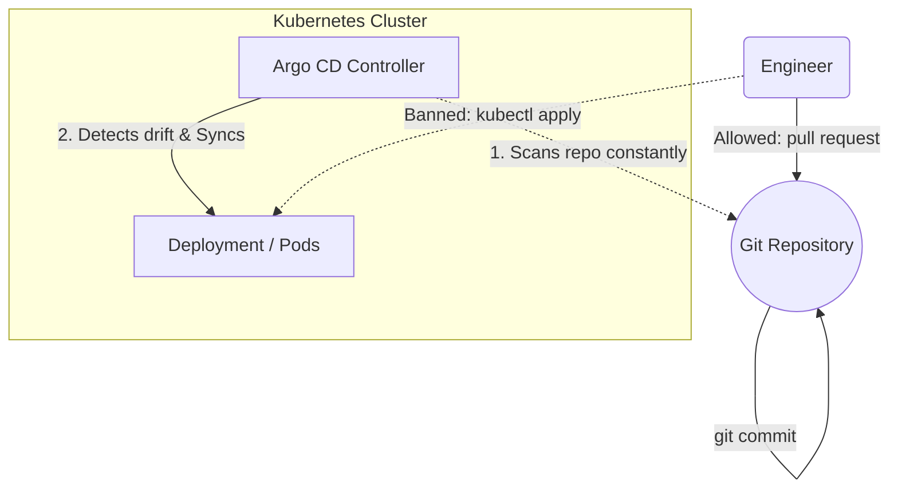

# 02 GitOps with Argo CD

## Metadata
- Duration: `25 minutes`
- Difficulty: `Intermediate`
- Practical/Theory: `80/20`
- Tested on Kubernetes: `v1.30`

## Learning Objective
By the end of this lesson, you will be able to:
- Explain what GitOps is and why `kubectl apply` is banned in modern environments.
- Define an Argo CD `Application` Custom Resource.
- Synchronize a live cluster aggressively against a Git repository.

## Why This Matters in Real Jobs
If engineers edit the cluster manually using `kubectl edit`, the cluster state instantly drifts away from the source code. GitOps dictates that the Git Repository is the *only* source of truth. Argo CD runs inside the cluster, constantly scanning Git. If Git changes, Argo changes the cluster automatically.

## Concepts (Short Theory)
- **GitOps:** An operational framework where Git is the absolute source of truth for the system's desired state.
- **Argo CD:** A declarative, GitOps continuous delivery tool deployed directly inside Kubernetes.
- **Drift:** When the live cluster configuration ceases to identically match the Git repository configurations.
- **Sync:** The act of Argo CD forcing the Cluster to match Git.

## Visual: Argo CD Synchronization



## Lab: Step-by-Step Practical

### Step 1 - Open directory
**Run:**
```bash
cd "$COURSE_DIR/04-CICD-and-GitOps/02-gitops-with-argocd"
```

### Step 2 - Inspect an ArgoCD Application CRD

**What happens when you run this:**
You read the definition file telling Argo CD exactly which GitHub repository to watch, what branch to target, and which namespace to deploy it into.

**Say:**
Notice `syncPolicy: automated`. This tells Argo CD to operate in aggressive GitOps mode: if it spots structural drift, it instantly heals the cluster.

**Run:**
```bash
cat yamls/application.yaml
```

## Hands-On Challenge
- If you have an active cluster with ArgoCD installed, run `kubectl apply -f yamls/application.yaml`. Then, use `kubectl edit deployment` inside the `guestbook` namespace and manually change the replica count. Watch how fast Argo CD instantly overrides your manual edit and snaps the replicas right back to the Git source of truth!

## Next Lesson
[03 Progressive Delivery](../03-progressive-delivery/README.md)
