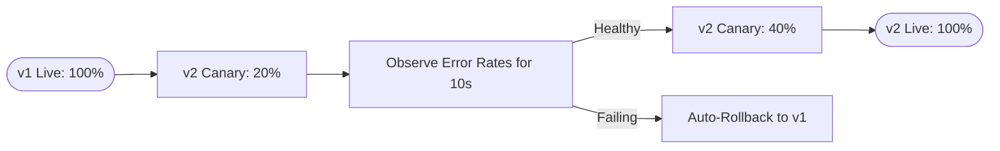

# 03 Progressive Delivery

## Metadata
- Duration: `20 minutes`
- Difficulty: `Advanced`
- Practical/Theory: `60/40`
- Tested on Kubernetes: `v1.30`

## Learning Objective
By the end of this lesson, you will be able to:
- Define Progressive Delivery and distinguish it from a basic Rolling Update.
- Analyze an Argo Rollouts configuration for a Canary deployment.

## Why This Matters in Real Jobs
A standard Kubernetes `Deployment` does a Rolling Update, shutting down old pods while bringing up new pods unconditionally. If the new code crashes on live API traffic, the rollout replaces everything anyway—causing a global outage. **Progressive Delivery** exposes the new code to a tiny fraction of traffic (e.g., 20%), pauses, and evaluates metrics before committing to 100%.

## Concepts (Short Theory)
- **Canary:** Releasing a new feature to a heavily restricted subset of live users before rolling out globally.
- **Blue/Green:** Maintaining two completely independent environments (v1 and v2) and instantaneously flipping traffic from one to the other via a load balancer switch.
- **Argo Rollouts:** A Kubernetes controller (similar to a Deployment) that natively implements advanced progressive traffic shaping.

## Visual: Canary Rollout Flow



## Lab: Step-by-Step Practical

### Step 1 - Open directory
**Run:**
```bash
cd "$COURSE_DIR/04-CICD-and-GitOps/03-progressive-delivery"
```

### Step 2 - Inspect a Progressive Canary Spec

**What happens when you run this:**
You examine an `argoproj.io/v1alpha1` Rollout resource. Notice that it looks identical to a Deployment, but adds a strict mathematical `strategy` matrix.

**Say:**
Argo Rollouts directly replaces the Deployment object. By looking closely at the YAML `steps:`, you can read the rollout plan exactly: Route 20% of traffic, pause for exactly 10 seconds, then expand to 40%. The rollout guarantees a catastrophic feature will never reach 100% of global users.

**Run:**
```bash
cat yamls/rollout.yaml
```

## Expected Output
You'll see a valid Kubernetes YAML demonstrating weights (`setWeight: 20`) and controlled logical pausing mechanisms. 

## Next Lesson
[04 Release Strategies](../04-release-strategies/README.md)
