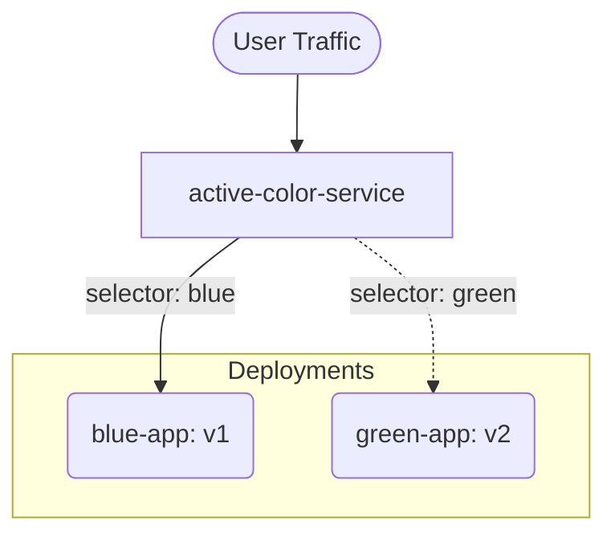

# 04 Release Strategies

## Metadata
- Duration: `15 minutes`
- Difficulty: `Intermediate`
- Practical/Theory: `80/20`
- Tested on Kubernetes: `v1.30`

## Learning Objective
By the end of this lesson, you will be able to:
- Manually execute a classic Blue/Green deployment using raw Kubernetes resources.
- Control active traffic flow strictly through Service label mutation.

## Why This Matters in Real Jobs
Before implementing complex continuous deployment controllers like Argo Rollouts, you must intrinsically understand how traffic manipulation mathematically works at the Kubernetes structural level. Blue/Green architecture relies entirely on isolating versioned Deployments behind a single unifying Service.

## Visual: Blue/Green Network Switch



## Lab: Step-by-Step Practical

### Step 1 - Open directory
**Run:**
```bash
cd "$COURSE_DIR/04-CICD-and-GitOps/04-release-strategies"
```

### Step 2 - Launch Both Environments

**What happens when you run this:**
We deploy two distinct versions of our application side-by-side simultaneously. `blue` represents v1 (stable), and `green` represents v2 (the newly tested feature).

**Run:**
```bash
kubectl apply -f yamls/blue-deployment.yaml
kubectl apply -f yamls/green-deployment.yaml
```

### Step 3 - Map the Active Route

**What happens when you run this:**
We apply the universal access Service. If you inspect the YAML, you will notice its routing `selector:` is distinctly hardcoded to target `version: blue`.

**Run:**
```bash
cat yamls/active-service.yaml
kubectl apply -f yamls/active-service.yaml
```

### Step 4 - Verify the Traffic Target

**What happens when you run this:**
We query the Service endpoints to prove that despite the Green deployment existing healthily behind the scenes, exactly 100% of the active Service traffic is strictly funneled into the Blue Pod IP addresses.

**Run:**
```bash
kubectl get endpoints active-color-service
kubectl get pods -l version=blue -o wide
```

## Hands-On Challenge
Execute the Blue/Green flip! Run `kubectl edit service active-color-service` or modify the underlying YAML directly. Change the target selector from `version: blue` directly to `version: green`. You have just instantaneously repaved production traffic without terminating a single live pod!

## Video close — fast validation

**What happens when you run this:**
We demolish both environments simultaneously.

**Run:**
```bash
kubectl delete -f yamls/blue-deployment.yaml
kubectl delete -f yamls/green-deployment.yaml
kubectl delete service active-color-service
```

## Next Lesson
[Track 05: Security and Policy](../../05-Security-and-Policy/01-pod-security-standards/README.md)
