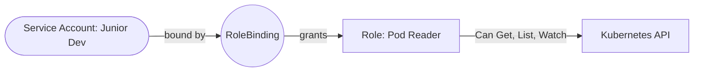

# 02 RBAC Design Patterns

## Metadata
- Duration: `20 minutes`
- Difficulty: `Intermediate`
- Practical/Theory: `70/30`
- Tested on Kubernetes: `v1.30`

## Learning Objective
By the end of this lesson, you will be able to:
- Bind strict, least-privilege Roles to specific ServiceAccounts.
- Emulate specific user queries effectively using `kubectl auth can-i`.

## Why This Matters in Real Jobs
You cannot give junior developers or automated CI/CD pipelines full "cluster-admin" access. Role-Based Access Control (RBAC) allows you to draw incredibly fine-grained boundaries—like "This user can read Logs, but cannot Delete Pods."

## Visual: RBAC Flow



## Lab: Step-by-Step Practical

### Step 1 - Open directory
**Run:**
```bash
cd "$COURSE_DIR/05-Security-and-Policy/02-rbac-design-patterns"
```

### Step 2 - Create the RBAC Architecture

**What happens when you run this:**
We instantiate the `junior-dev` ServiceAccount, the `pod-reader` Role (which solely permits `get/list/watch`), and the Binding that locks them together.

**Run:**
```bash
kubectl apply -f yamls/service-account.yaml
kubectl apply -f yamls/dev-role.yaml
kubectl apply -f yamls/dev-rolebinding.yaml
```

### Step 3 - Test Allowed Operations

**What happens when you run this:**
We impersonate the `junior-dev` ServiceAccount seamlessly to check if Kubernetes permits us to read Pods.

**Run:**
```bash
kubectl auth can-i list pods --as=system:serviceaccount:default:junior-dev
```

### Step 4 - Test Denied Operations

**What happens when you run this:**
We ask the API server if the `junior-dev` account is mathematically capable of deleting Pods, or editing Secrets.

**Run:**
```bash
kubectl auth can-i delete pods --as=system:serviceaccount:default:junior-dev
kubectl auth can-i get secrets --as=system:serviceaccount:default:junior-dev
```

## Expected Output
Step 3 must return exactly `yes`.
Step 4 must return exactly `no` indicating total API denial.

## Next Lesson
[03 Network Policies](../03-network-policies/README.md)
