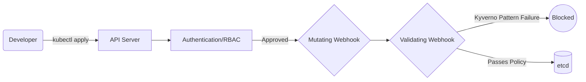

# 04 Admission Controls

## Metadata
- Duration: `15 minutes`
- Difficulty: `Advanced`
- Practical/Theory: `40/60`
- Tested on Kubernetes: `v1.30`

## Learning Objective
By the end of this lesson, you will be able to:
- Explain what the Admission Control phase acts as within the API request lifecycle.
- Formulate a structural policy payload utilizing engines like Kyverno to physically mutate or reject invalid resource requests.

## Why This Matters in Real Jobs
You might have organizational rules: "Every Deployment must have a cost-center label" or "Nobody is allowed to pull images from public DockerHub." You cannot enforce these rules using RBAC. You must intercept the raw YAML during submission and run pattern checks. This is Webhook Admission Control (via tools like Kyverno or OPA Gatekeeper).

## Visual: Submission Journey



## Lab: Step-by-Step Practical

### Step 1 - Open directory
**Run:**
```bash
cd "$COURSE_DIR/05-Security-and-Policy/04-admission-controls"
```

### Step 2 - Inspect a Validation Policy

**What happens when you run this:**
We read a `ClusterPolicy` that instructs the validator logic: If the requested resource is a `Pod`, it absolutely must structurally possess an `env` label in its metadata. If it doesn't, reject it before it ever touches `etcd`.

**Run:**
```bash
cat yamls/require-labels-policy.yaml
```

## Next Lesson
[05 Image Signing and SBOMs](../05-image-signing-sbom/README.md)
