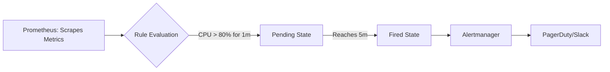

# 02 Alerting and SLOs

## Metadata
- Duration: `10 minutes`
- Difficulty: `Intermediate`
- Practical/Theory: `40/60`
- Tested on Kubernetes: `v1.30`

## Learning Objective
By the end of this lesson, you will be able to:
- Read PromQL syntax embedded inside an alerting matrix.
- Understand the concept of "Time-duration" gating to prevent alert fatigue.

## Why This Matters in Real Jobs
Engineers ignore alerts if their phone buzzes every time CPU spikes for 3 seconds. Real operational alerting enforces time gates (`for: 5m`) ensuring that the pager only fires if the condition is a sustained failure impacting the Service Level Objective (SLO).

## Visual: Alert Pipeline



## Lab: Step-by-Step Practical

### Step 1 - Open directory
**Run:**
```bash
cd "$COURSE_DIR/06-Observability-and-Reliability/02-alerting-and-slos"
```

### Step 2 - Inspect an Alerting Rule

**What happens when you run this:**
We read a custom `PrometheusRule` Custom Resource. Notice the PromQL math calculating physical container CPU seconds and comparing it to `> 80`. 

**Say:**
The golden rule of SRE alerting is the `for: 5m` block. The alert suppresses itself until the condition has mathematically remained dangerously high for 5 unbroken minutes.

**Run:**
```bash
cat yamls/alert-rule.yaml
```

## Next Lesson
[03 Autoscaling Decisions](../03-autoscaling-decisions/README.md)
