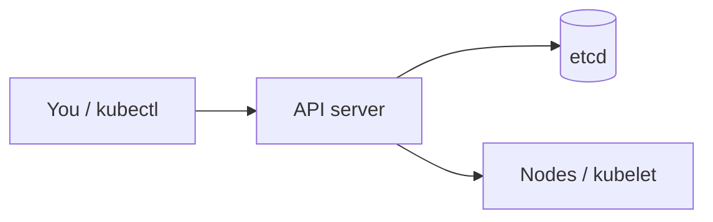
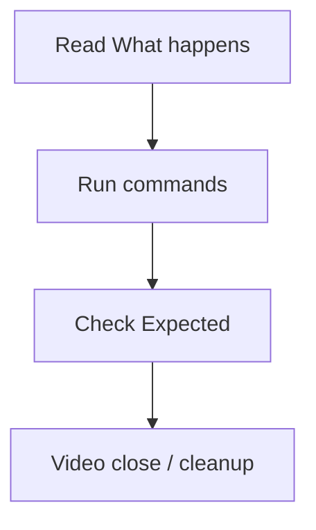

# Lesson Template (Practical-First)

Use this template for every lesson README.

## Title

`# 01 deploy enterprise app`

## Metadata

- Duration: `<minutes>`
- Difficulty: `<Beginner|Intermediate|Advanced>`
- Practical/Theory: `70/30`
- Tested on Kubernetes: `<latest stable version at authoring date>`
- Also valid for: `<previous stable version>`
- Lab OS: `Linux`
- Platform: `<Local (kubeadm/kind/minikube) | EKS extension>`

## Learning Objective

By the end of this lesson, you will be able to:

- `<actionable skill 1>`
- `<actionable skill 2>`
- `<actionable skill 3>`

## Why This Matters in Real Jobs

`<Explain where this appears in real teams and incidents.>`

## Prerequisites

- `<required tools>`
- `<required previous lessons>`
- `<minimum machine resources>`

## Concepts (Short Theory)

No fluff. Keep this section short and only include concepts needed for the lab.

- `<concept 1 in simple words>`
- `<concept 2 in simple words>`
- `<concept 3 in simple words>`

Rules:

- Maximum 5 bullets.
- Maximum 1-2 lines per bullet.
- Each bullet must map to a concrete lab step.

## Visual: architecture or workflow (required)

Every lesson README must include **at least one** diagram so the page is not “wall of text.” Prefer **Mermaid** inside the same `README.md` (renders on GitHub, GitLab, and many Markdown previewers).

**Placement:** Put the diagram **early**—right after **Intro** / **Concepts** and **before** the first **Lab** or **Quick Start**—so learners see structure before commands.

**Choose one (or combine):**

| Diagram type | When to use | Mermaid keyword |
|--------------|-------------|-----------------|
| **Course / lesson flow** | “What order do I do things?” | `flowchart LR` or `flowchart TB` |
| **Architecture** | “What talks to what?” | `flowchart TB` with `subgraph` |
| **Sequence / request path** | “What happens when I run kubectl apply?” | `sequenceDiagram` |
| **State / decision** | “If X fails, what do I check?” | `flowchart TD` with diamond nodes |

**Rules:**

- Keep **5–12 nodes** when possible; split into a second diagram if the lesson is huge.
- **No secrets** or environment-specific hostnames in diagrams—use generic labels (`API server`, `Worker node`).
- Use **one code fence** per diagram: ` ```mermaid ` … ` ``` ` (blank line before the fence).

**Minimal example (architecture):**



**Minimal example (lab workflow):**



## Lab: Step-by-Step Practical

### Step 1 - Setup

```bash
# commands
```

Explain briefly what changed after this step.

### Step 2 - Deploy/Configure

```bash
# commands
```

Explain why this step is done in one simple sentence.

### Step 3 - Verify

```bash
# commands
```

Add one success signal and one failure signal.

## Expected Output

- `<what success looks like>`
- `<sample key output line>`

## Troubleshooting (Top 5)

1. `<error pattern>` -> `<fix>`
2. `<error pattern>` -> `<fix>`
3. `<error pattern>` -> `<fix>`
4. `<error pattern>` -> `<fix>`
5. `<error pattern>` -> `<fix>`

## Hands-On Challenge

- `<small challenge to reinforce learning>`

## Assessment

- Quiz:
  - `<question 1>`
  - `<question 2>`
- Practical check:
  - `<state validation command>`

## Version and Compatibility Notes

- API changes:
  - `<if any>`
- Deprecated fields:
  - `<if any>`
- Migration tip from previous stable:
  - `<tip>`

## Summary

- `<key command pattern 1>`
- `<key troubleshooting rule>`
- `<key production habit>`

## Next Lesson

`<next lesson path and why it follows logically>`

## Transcript (Simple Spoken English)

**Relationship to the Lab:** The transcript is **spoken narration** for the same steps as **Lab** and **Quick Start**—what you say on video or in class while those commands are on screen. It is not a separate lesson track. **Part 0** skips this block and uses a single **Read-through (Say → Run → See)** instead.

**Optional: Read-through (merged format):** Use **Say** → **Run** → **See** in one linear section (spoken line, then bash block, then expected output). Part **0** uses this as the main lesson body instead of a separate timed transcript.

**What happens before Run (instructor speed):** For each step that runs commands or a script, add **What happens when you run this** (short bullets) *before* **Run** so you can narrate without discovering side effects live. Match the top-of-file **WHAT THIS DOES WHEN YOU RUN IT** comment block in every `scripts/*.sh` helper (same story in two places: README for the camera, script for `cat`/`less` while teaching).

`[0:00-0:30]`  
`<Hook: what learner will achieve>`

`[0:30-2:00]`  
`<Explain concept with real-world analogy>`

`[2:00-7:00]`  
`<Walk through commands and expected behavior>`

`[7:00-9:00]`  
`<Troubleshooting and common mistakes>`

`[9:00-10:00]`  
`<Recap and next steps>`

