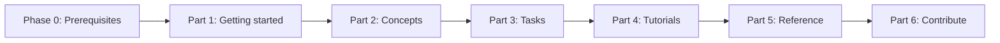

# Kubernetes Complete Course

Course structure generated from the table of contents in `k8s-toc.pdf`.

## Course flow (diagram)

## Layout

- `part-0-prerequisites` is Phase 1 (Linux + Docker) before Part 1; lessons follow the same practical README pattern as the Kubernetes track.
- Each other `part-*` folder maps to a top-level part from the PDF.
- Each module is a folder with its own `README.md`.
- Sections and deeper subsections are created as nested folders to preserve the source hierarchy.

## Parts

- **Phase 1 — Prerequisites** (before Part 1): [`part-0-prerequisites`](part-0-prerequisites/README.md) — Linux basics for Kubernetes, then Docker basics for Kubernetes.
- Part 1: GETTING STARTED
- Part 2: CONCEPTS
- Part 3: TASKS
- Part 4: TUTORIALS
- Part 5: REFERENCE
- Part 6: CONTRIBUTE TO KUBERNETES

## Course Build Assets

- `COURSE_MASTER_PLAN.md` - target architecture for a job-ready course
- `LESSON_TEMPLATE.md` - standard lesson structure for consistency
- `TRANSCRIPT_STYLE_GUIDE.md` - simple, practical transcript writing standard
- `ROADMAP.md` - phased execution plan to complete the course
- `KUBERNETES_VERSION_MATRIX.md` - latest stable and previous stable policy tracking
