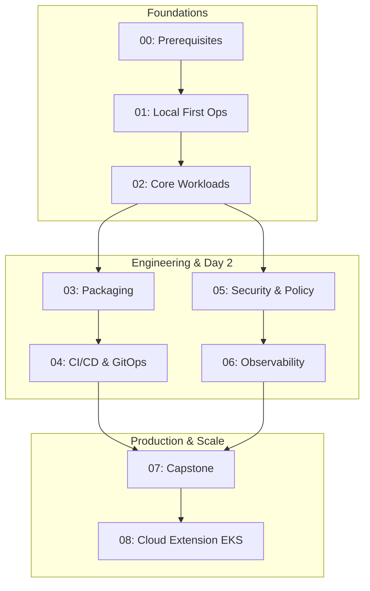

# Kubernetes Complete Course

Course structure generated from the table of contents in `k8s-toc.pdf`.

## Course flow — dependencies and time (honest)

**Required path for a coherent “I can run a cluster and reason about it” story:** `00-Prerequisites` → `01-Local-First-Operations` → `02-Core-Workloads`. The remaining tracks build advanced skills.

| Segment | Role | Rough time | Status in repo |
|---------|------|------------|----------------|
| 00 - Prerequisites | Linux + Docker for K8s | 4–8 h | Complete |
| 01 - Local First | Local / kubeadm clusters | 12–24 h | Usable; HA lessons need multi-node labs |
| 02 - Core Workloads | API, architecture, workloads+ | 20–40 h+ | Core workloads usable; expanding... |
| 03 - 08 | Packaging, CI/CD, Security, Cloud... | — | Scaffolding / Planned |

Version policy and tested lines: [`KUBERNETES_VERSION_MATRIX.md`](KUBERNETES_VERSION_MATRIX.md).

**Track 2 entry check:** after Track 1, run validation scripts in `02-Core-Workloads`.

## Layout

- `00-Prerequisites` is Phase 1 (Linux + Docker). Lessons follow the same practical README pattern.
- Each numbered folder maps to a Track from the `COURSE_MASTER_PLAN.md`.
- Each module is a folder with its own `README.md`.

## Tracks

- **Track 0:** [`00-Prerequisites`](00-Prerequisites/README.md)
- **Track 1:** [`01-Local-First-Operations`](01-Local-First-Operations/README.md)
- **Track 2:** [`02-Core-Workloads`](02-Core-Workloads/README.md)
- **Track 3:** [`03-Packaging-and-Environments`](03-Packaging-and-Environments/README.md)
- **Track 4:** [`04-CICD-and-GitOps`](04-CICD-and-GitOps/README.md)
- **Track 5:** [`05-Security-and-Policy`](05-Security-and-Policy/README.md)
- **Track 6:** [`06-Observability-and-Reliability`](06-Observability-and-Reliability/README.md)
- **Track 7:** [`07-Capstone-Project`](07-Capstone-Project/README.md)
- **Cloud:** [`08-Cloud-Extension-EKS`](08-Cloud-Extension-EKS/README.md)

## Course Build Assets

- `COURSE_MASTER_PLAN.md` - target architecture for a job-ready course
- `LESSON_TEMPLATE.md` - standard lesson structure for consistency
- `TRANSCRIPT_STYLE_GUIDE.md` - simple, practical transcript writing standard
- `ROADMAP.md` - phased execution plan to complete the course
- `KUBERNETES_VERSION_MATRIX.md` - latest stable and previous stable policy tracking
