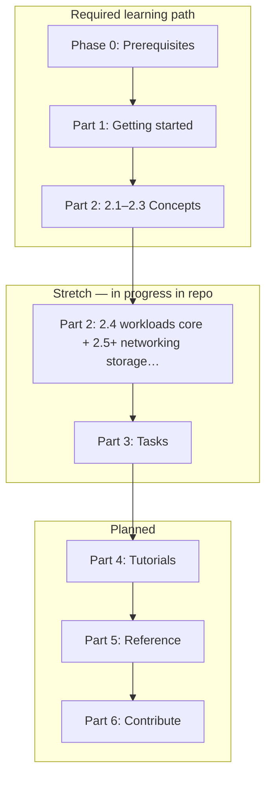

# Kubernetes Complete Course

Course structure generated from the table of contents in `k8s-toc.pdf`.

## Course flow — dependencies and time (honest)

**Required path for a coherent “I can run a cluster and reason about it” story:** Phase 0 → Part 1 → Part 2 (modules **2.1–2.3** are teaching-complete in-repo; **2.4** has a runnable **workload core** (**2.4.1.1**, **2.4.3.1–2.4.3.8**, **2.4.4**) plus [`verify-2-4-workloads-module.sh`](part-2-concepts/2.4-workloads/scripts/verify-2-4-workloads-module.sh); **2.5.1 Service** introduces ClusterIP + endpoints ([`verify-2-5-1-service-lesson.sh`](part-2-concepts/2.5-services-load-balancing-and-networking/2.5.1-service/scripts/verify-2-5-1-service-lesson.sh)). Remaining **2.5+** is still being expanded. Parts 3–6 are **planned** — treat their folders as scaffolding unless a README says otherwise.

| Segment | Role | Rough time | Status in repo |
|---------|------|------------|----------------|
| Phase 0 — Prerequisites | Linux + Docker for K8s | 4–8 h | Complete |
| Part 1 — Getting started | Local / kubeadm clusters | 12–24 h | Usable; HA lessons need multi-node labs |
| Part 2 — Concepts | API, architecture, containers, then workloads+ | 20–40 h+ | **2.1–2.3** + **2.4** core + **2.4.4** rollouts + **2.5.1** Service lab; rest of **2.5+** still growing |
| Part 3 — Tasks | Day-2 recipes | — | Mostly scaffolding |
| Parts 4–6 | Tutorials, reference, contribute | — | Placeholders |

Version policy and tested lines: [`KUBERNETES_VERSION_MATRIX.md`](KUBERNETES_VERSION_MATRIX.md).

**Part 2 entry check:** after Part 1, run [`part-2-concepts/scripts/verify-part2-prerequisites.sh`](part-2-concepts/scripts/verify-part2-prerequisites.sh).

## Layout

- `part-0-prerequisites` is Phase 1 (Linux + Docker) before Part 1; lessons follow the same practical README pattern as the Kubernetes track.
- Each other `part-*` folder maps to a top-level part from the PDF.
- Each module is a folder with its own `README.md`.
- Sections and deeper subsections are created as nested folders to preserve the source hierarchy.

## Parts

- **Phase 1 — Prerequisites** (before Part 1): [`part-0-prerequisites`](part-0-prerequisites/README.md) — Linux basics for Kubernetes, then Docker basics for Kubernetes.
- Part 1: GETTING STARTED
- Part 2: CONCEPTS
- Part 3: TASKS
- Part 4: TUTORIALS
- Part 5: REFERENCE
- Part 6: CONTRIBUTE TO KUBERNETES

## Course Build Assets

- `COURSE_MASTER_PLAN.md` - target architecture for a job-ready course
- `LESSON_TEMPLATE.md` - standard lesson structure for consistency
- `TRANSCRIPT_STYLE_GUIDE.md` - simple, practical transcript writing standard
- `ROADMAP.md` - phased execution plan to complete the course
- `KUBERNETES_VERSION_MATRIX.md` - latest stable and previous stable policy tracking
