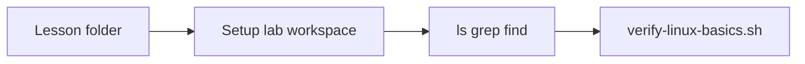

# 0.1 Linux Basics for Kubernetes — teaching transcript

## Intro

Alright — in this lesson, we’re not learning full Linux.

We’re only focusing on the exact shell skills you’ll use in Kubernetes labs and real DevOps work:

- Navigating folders
- Reading logs
- Filtering output
- Doing quick system checks

That’s it.

If you’re completely new to terminal — don’t worry.
You just need to:

- Open terminal
- Paste commands
- Press Enter

If you’re on Windows, use WSL2 with Ubuntu.

Replace **`/path/to/K8sOps`** in the steps below with the folder where you cloned this repo.

If this feels overwhelming — do the first steps and come back later.

**Teaching tip:** Each step includes **What happens when you run this** so you know the effect *before* you paste. **Say** is optional camera talk. The shell scripts in `scripts/` repeat the same story in a comment header at the top of each file.

## Flow of this lesson



---

## Step 1 — Move into the lesson folder

**What happens when you run this:**  
`cd` changes your shell’s working directory to the lesson folder (paths like `scripts/` resolve from there). `pwd` prints the full path — no files are created or changed.

**Say:**  
I move into the lesson directory so `scripts/` paths work. `pwd` shows my location.

**Run:**

```bash
cd /path/to/K8sOps/part-0-prerequisites/0.1-linux-basics-for-kubernetes
pwd
```

**Expected:**  
Path ending with `0.1-linux-basics-for-kubernetes`.

---

## Step 2 — Set up the lab workspace

**What happens when you run this:**  
`chmod +x scripts/*.sh` marks every script in `scripts/` as executable (so `./script.sh` works). `./scripts/setup-linux-lab-workspace.sh` creates `~/k8sops-p0-linux-lab` (or `K8SOPS_P0_LINUX_LAB`) and **copies** the contents of `lab-files/` into it — your repo is unchanged; the lab is a disposable copy.

**Say:**  
Scripts need execute permission. Setup copies sample files into a folder under my home directory — safe to delete later.

**Run:**

```bash
chmod +x scripts/*.sh
./scripts/setup-linux-lab-workspace.sh
```

**Expected:**  
`Lab workspace ready at: .../k8sops-p0-linux-lab`  
(Optional: set `K8SOPS_P0_LINUX_LAB` before setup if you want a different path.)

---

## Step 3 — Explore files

**What happens when you run this:**  
`cd` goes to the lab workspace. `pwd` confirms location. `ls -la` lists all files (including hidden) with details — read-only; nothing is modified.

**Say:**  
I work inside the lab folder. `ls` is a bit like `kubectl get` — what exists *here*?

**Run:**

```bash
cd "${K8SOPS_P0_LINUX_LAB:-$HOME/k8sops-p0-linux-lab}"
pwd
ls -la
```

**Expected:**  
`servers.log`, `config.env`, and `nested/`.

---

## Step 4 — Read logs

**What happens when you run this:**  
`grep 'ERROR' servers.log` reads `servers.log` and prints only lines containing the substring `ERROR` — stdout only; the file is not changed.

**Say:**  
`grep` keeps lines that match — same habit you’ll use with long `kubectl logs` output.

**Run:**

```bash
grep 'ERROR' servers.log
```

**Expected:**  
Two lines containing `ERROR`.

---

## Step 5 — Count matches

**What happens when you run this:**  
`grep` outputs matching lines; `|` pipes that stream into `wc -l`, which counts newline-terminated lines and prints one number — still read-only on disk.

**Say:**  
The pipe `|` sends the left command’s output into the right command. Here I count how many lines matched.

**Run:**

```bash
grep 'ERROR' servers.log | wc -l
```

**Expected:**  
A small number (e.g. `2`).

---

## Step 6 — Read specific parts

**What happens when you run this:**  
`grep '^APP_' config.env` prints lines in `config.env` that **start with** `APP_`. `head -n 2 servers.log` prints the first two lines of the log; `tail -n 2 servers.log` prints the last two — all read-only.

**Say:**  
`^APP_` in a pattern means lines that *start with* `APP_`. `head` / `tail` show the start or end of a file.

**Run:**

```bash
grep '^APP_' config.env
head -n 2 servers.log
tail -n 2 servers.log
```

**Expected:**  
Lines starting with `APP_`, plus first two and last two log lines.

---

## Step 7 — Find and quick system check

**What happens when you run this:**  
`find . -type f -name '*.txt'` walks the current directory tree and prints paths of `.txt` files. `ps aux | head -n 5` shows a snapshot of running processes (first five lines). The `ss` / `netstat` line tries listening TCP sockets — read-only introspection; `|| true` avoids failing the whole line if a tool is missing.

**Say:**  
`find` locates files when you forgot the path. `ps` lists processes; `ss` (or `netstat`) shows listening ports — quick health checks.

**Run:**

```bash
find . -type f -name '*.txt'
ps aux | head -n 5
command -v ss >/dev/null && ss -tlnp | head -n 10 || netstat -tlnp 2>/dev/null | head -n 10 || true
```

**Expected:**  
At least `./nested/data.txt` from `find`; other output varies by machine.

---

## Step 8 — Verify

**What happens when you run this:**  
`./scripts/verify-linux-basics.sh` `cd`s into the lab folder, counts `ERROR` lines and total lines in `servers.log`, checks `nested/data.txt` exists, then prints `verify-linux-basics: OK` or exits with an error — it does **not** modify your files.

**Say:**  
The course script checks that the workspace and grep results match what we expect.

**Run:**

```bash
cd /path/to/K8sOps/part-0-prerequisites/0.1-linux-basics-for-kubernetes
./scripts/verify-linux-basics.sh
```

**Expected:**  
`verify-linux-basics: OK`.

---

## Repo files (reference)

| Path | Purpose |
|------|---------|
| `lab-files/` | Source files copied into `~/k8sops-p0-linux-lab` by setup |
| `scripts/setup-linux-lab-workspace.sh` | Creates the lab folder |
| `scripts/verify-linux-basics.sh` | Step 8 check |
| `yamls/failure-troubleshooting.yaml` | Optional cheat sheet (same idea as K8s lesson YAMLs) |

---

## Troubleshooting

- Wrong folder → `pwd` and `ls`
- Permission denied → `chmod +x scripts/*.sh`
- `grep` empty → you must be in `~/k8sops-p0-linux-lab` for steps 4–7
- `ss` missing → use `netstat` if present, or skip
- WSL → keep labs under `~/` in Linux, not only under `/mnt/c/`

---

## Learning objective

- `cd`, `pwd`, `ls`
- `grep` and pipes
- Basic troubleshooting

---

## Why this matters

In real DevOps:

- You debug in the terminal
- You read logs
- You filter for the signal

Speed here = calmer incidents later.

---

## Challenge

**What happens when you run this:**  
You edit `servers.log` in the lab workspace (add a line with `ERROR`), then the verify script re-runs the same checks — it should still pass with a higher error-line count.

Add another line containing `ERROR` to `servers.log`, then run:

```bash
cd /path/to/K8sOps/part-0-prerequisites/0.1-linux-basics-for-kubernetes
./scripts/verify-linux-basics.sh
```

---

## Next

[0.2 Docker basics for Kubernetes](../0.2-docker-basics-for-kubernetes/README.md)
