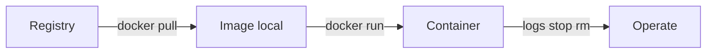

# 0.2 Docker Basics for Kubernetes — teaching transcript

## Intro

Alright — in this lesson, we’re not becoming Docker experts.

We’re learning the **same words Kubernetes uses**:

- **Image** — the packaged app (layers + metadata)
- **Container** — one running instance of an image
- **Pull / run / logs / ports** — what you’ll debug on a cluster later, just smaller here

That’s the thread.

**Before this:** finish [0.1 Linux basics](../0.1-linux-basics-for-kubernetes/README.md) (terminal + `cd` + paste commands).

**You need:** Docker installed and running — `docker info` should work with no “cannot connect to daemon” error. (Docker Desktop on Windows/Mac, or Docker Engine on Linux. Podman with a `docker`-compatible CLI is fine.)

Replace **`/path/to/K8sOps`** in the steps below with the folder where you cloned this repo.

If pulls or builds are slow — do **Steps 1–4**, take a break, then do **5–6**.

**Teaching tip:** Each step includes **What happens when you run this** so you know the effect *before* you paste. **Say** is optional camera talk. `scripts/verify-docker-basics.sh` has the same explanation in a comment header at the top of the file.

## Image to container (same vocabulary as Kubernetes)



---

## Step 1 — Move into the lesson folder

**What happens when you run this:**  
`cd` moves into the lesson folder; `pwd` prints the path — no Docker state changes.

**Say:**  
I work from this lesson directory so `docker/` and `scripts/` paths are correct.

**Run:**

```bash
cd /path/to/K8sOps/part-0-prerequisites/0.2-docker-basics-for-kubernetes
pwd
```

**Expected:**  
Path ending with `0.2-docker-basics-for-kubernetes`.

---

## Step 2 — Prove the Docker client talks to the daemon

**What happens when you run this:**  
`docker version` asks the CLI and daemon for version strings (proves both sides exist). `docker info` dumps daemon configuration and confirms the socket/API is reachable — still no containers created yet.

**Say:**  
If this step fails, nothing else will work — I fix Docker Desktop or `docker.service` first, not Kubernetes.

**Run:**

```bash
docker version
docker info
```

**Expected:**  
Client and Server sections; **no** “Cannot connect to the Docker daemon”.

---

## Step 3 — Pull an image and run a one-shot container

**What happens when you run this:**  
`docker pull hello-world` downloads image layers to local storage. `docker run --rm hello-world` creates a container from that image, runs its entrypoint (prints the hello message), then **removes** the container on exit — the image stays cached locally.

**Say:**  
`docker pull` copies an image from a **registry** (here, Docker Hub). `docker run` starts a **container**. `--rm` deletes the container when it exits — good for demos.

**Run:**

```bash
docker pull hello-world
docker run --rm hello-world
```

**Expected:**  
“Hello from Docker!” (or similar) success message.

---

## Step 4 — Build a small image and run it

**What happens when you run this:**  
`chmod +x scripts/*.sh` makes helper scripts executable. `docker build -t k8sops-p0-lab:0.2 docker/` reads `docker/Dockerfile`, runs its instructions, and tags the result as `k8sops-p0-lab:0.2` locally. `docker run --rm k8sops-p0-lab:0.2` runs one container from that tag and removes it when it exits.

**Say:**  
A **Dockerfile** is a recipe. `docker build` creates a **tagged image** on my machine. `docker run` starts a container from that image — same idea as a Pod that uses `image: ...` in YAML.

**Run:**

```bash
cd /path/to/K8sOps/part-0-prerequisites/0.2-docker-basics-for-kubernetes
chmod +x scripts/*.sh
docker build -t k8sops-p0-lab:0.2 docker/
docker run --rm k8sops-p0-lab:0.2
```

**Expected:**  
Build completes; container prints something like `K8sOps Part 0 Docker lab`.

---

## Step 5 — Run a server in the background, hit a port, clean up

**What happens when you run this:**  
`docker run -d --name k8sops-p0-web -p 8080:80 nginx:...` pulls `nginx` if needed, starts it **detached** with a fixed name, and publishes host `8080` → container `80`. `docker ps --filter` lists that running container. `docker logs ... | tail` shows the last few log lines. `curl` sends an HTTP GET to localhost:8080 and prints only the status code. `docker stop` stops the container; `docker rm` removes it (the `2>/dev/null || true` ignores “already removed” noise).

**Say:**  
`-p 8080:80` means: traffic to **my machine’s port 8080** goes to **port 80 inside the container**. That’s the same *idea* as publishing a service later — just on my laptop. I use a **name** so I can stop and remove the container cleanly.

**Run:**

```bash
docker run -d --name k8sops-p0-web -p 8080:80 nginx:1.27-alpine
docker ps --filter name=k8sops-p0-web
docker logs k8sops-p0-web 2>&1 | tail -n 5
curl -sS -o /dev/null -w "%{http_code}\n" http://127.0.0.1:8080/
docker stop k8sops-p0-web
docker rm k8sops-p0-web 2>/dev/null || true
```

**Expected:**  
Container shows as running in `docker ps`; `curl` prints `200` (or another success HTTP code); stop/rm completes without a name conflict next time.

---

## Step 6 — Run the course verify script

**What happens when you run this:**  
`./scripts/verify-docker-basics.sh` checks `docker info`, then pull/run `hello-world`, then build `docker/Dockerfile` and run that image — end-to-end smoke test; leaves the built image tagged on your machine.

**Say:**  
This script repeats pull, build, and run so I can regression-check my machine anytime.

**Run:**

```bash
cd /path/to/K8sOps/part-0-prerequisites/0.2-docker-basics-for-kubernetes
./scripts/verify-docker-basics.sh
```

**Expected:**  
`verify-docker-basics: OK`.

---

## Repo files (reference)

| Path | Purpose |
|------|---------|
| `docker/Dockerfile` | Image recipe used in Step 4 |
| `scripts/verify-docker-basics.sh` | Step 6 — full check |
| `yamls/failure-troubleshooting.yaml` | Optional cheat sheet (same idea as K8s lesson YAMLs) |

---

## Troubleshooting

- Cannot connect to daemon → start Docker Desktop or `sudo systemctl start docker` (Linux)
- Permission denied on socket → add user to `docker` group and re-login, or rootless Docker per your distro
- Port already in use → use `-p 8081:80` or `docker stop` the old container using `8080`
- Pull timeout / build fails on `FROM` → network, VPN, corporate proxy, or registry mirror
- Leftover `k8sops-p0-web` → `docker rm -f k8sops-p0-web` then retry Step 5

---

## Learning objective

- Explain **image** vs **container**
- `pull`, `run` (with and without `--rm`), `build`, `-p`, `logs`, `stop`, `rm`
- Run `./scripts/verify-docker-basics.sh` successfully

---

## Why this matters

On a cluster, workloads are **containers from images**. When something breaks, you’ll think in terms of pull errors, crash loops, ports, and logs — same vocabulary as this lesson, just with `kubectl` in front later.

---

## Challenge

Add a line to `docker/Dockerfile` after the existing `RUN` (still as root), for example:

```dockerfile
ENV LAB_USER=yourname
```

Rebuild and prove the variable is visible:

**What happens when you run this:**  
Rebuild bakes `ENV LAB_USER=...` into a new image layer. `docker run ... env | grep LAB_USER` starts a throwaway container, dumps environment variables, and filters for your variable — proves the image carries that metadata.

**Run:**

```bash
cd /path/to/K8sOps/part-0-prerequisites/0.2-docker-basics-for-kubernetes
docker build -t k8sops-p0-lab:0.2 docker/
docker run --rm k8sops-p0-lab:0.2 env | grep LAB_USER
```

**Expected:**  
`LAB_USER=yourname` (or whatever you set).

---

## Next

[Part 1: Getting Started](../../part-1-getting-started/README.md)
