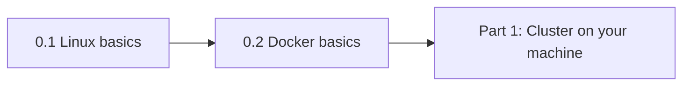

# Phase 1 — Prerequisites (before Part 1)

Complete this phase **before** [Part 1: Getting Started](../part-1-getting-started/README.md). Kubernetes assumes you are comfortable on the Linux command line and understand what containers are and how images run.

## Phase flow



## Modules

Each lesson is a **teaching transcript**: numbered steps with **Say → Run → Expected** (same style as **0.1** and **0.2**).

| Module | README | Assets |
|--------|--------|--------|
| **0.1** | [Linux basics](0.1-linux-basics-for-kubernetes/README.md) | `lab-files/`, `scripts/`, `yamls/failure-troubleshooting.yaml` |
| **0.2** | [Docker basics](0.2-docker-basics-for-kubernetes/README.md) | `docker/Dockerfile`, `scripts/verify-docker-basics.sh`, `yamls/failure-troubleshooting.yaml` |

Each module includes:

- `scripts/` — runnable setup and verify scripts (like Part 1 labs)
- `yamls/failure-troubleshooting.yaml` — ConfigMap asset matching Kubernetes lessons (optional `kubectl apply` if you want it in-cluster)

## Why this is Phase 1

- All labs in this course use **Linux-only** commands ([`COURSE_MASTER_PLAN.md`](../COURSE_MASTER_PLAN.md)).
- Kubernetes runs **containers**; without runtime basics, node and workload debugging stays opaque.
- Skipping this phase usually shows up as wasted time in Part 1 (Minikube/kind, `kubectl`, logs).

## Completion check

You are ready for Part 1 when:

- `./scripts/verify-linux-basics.sh` exits `0` from `0.1-linux-basics-for-kubernetes` (after setup).
- `./scripts/verify-docker-basics.sh` exits `0` from `0.2-docker-basics-for-kubernetes`.

## Part wrap — quick validation

```bash
uname -a
test -x part-0-prerequisites/0.1-linux-basics-for-kubernetes/scripts/verify-linux-basics.sh && \
  (cd part-0-prerequisites/0.1-linux-basics-for-kubernetes && ./scripts/verify-linux-basics.sh)
command -v docker >/dev/null && part-0-prerequisites/0.2-docker-basics-for-kubernetes/scripts/verify-docker-basics.sh || echo "Complete 0.2 when Docker is installed"
```

From the **repository root**, adjust paths if your clone layout differs; from each module directory, run `./scripts/verify-*.sh` directly.

Green lights: Linux verify OK; Docker verify OK once the daemon is running.
