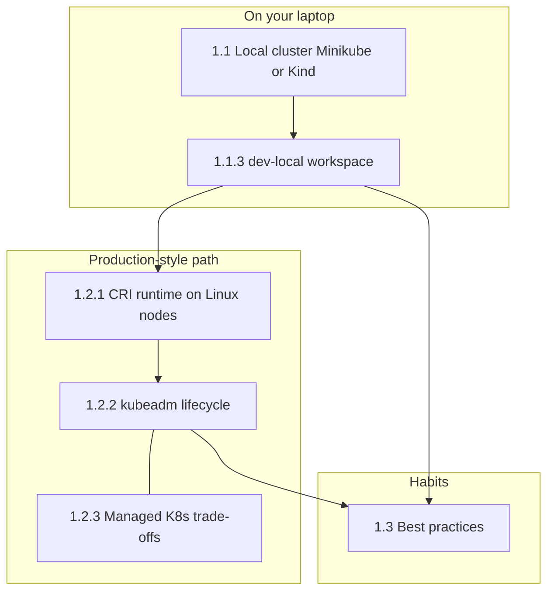

# Part 1: GETTING STARTED

**Prerequisites:** Complete [Phase 1 — Prerequisites](../part-0-prerequisites/README.md) (Linux basics, then Docker basics) before this part unless you already have that background.

Hands-on path: **1.1** (local cluster + `dev-local` workspace) → **1.2** (production-style runtime + kubeadm + cloud trade-offs) → **1.3** (operational habits: scale, zones, nodes, security, PKI).

## Part 1 map



## Recommended order (sequential)

Follow this when you want a single clean track from zero to “Part 1 done”:

1. [Part 0 — Prerequisites](../part-0-prerequisites/README.md) — 0.1 Linux, 0.2 Docker.
2. [1.1.1 Minikube](1.1-learning-environment/1.1.1-minikube-setup-and-configuration/README.md) **or** [1.1.2 Kind](1.1-learning-environment/1.1.2-kind-kubernetes-in-docker/README.md) (pick one local stack).
3. [1.1.3 Local development clusters](1.1-learning-environment/1.1.3-local-development-clusters/README.md) — `dev-local` workspace on that cluster.
4. [1.2.1 Container runtimes](1.2-production-environment/1.2.1-container-runtimes/README.md) — pick **one** of [containerd](1.2-production-environment/1.2.1-container-runtimes/1.2.1.1-containerd/README.md) / [CRI-O](1.2-production-environment/1.2.1-container-runtimes/1.2.1.2-cri-o/README.md) / [Docker + cri-dockerd](1.2-production-environment/1.2.1-container-runtimes/1.2.1.3-docker-engine-via-cri-dockerd/README.md) on Linux lab nodes (skip if you stay only on local Minikube/Kind for now).
5. [1.2.2 Installing Kubernetes](1.2-production-environment/1.2.2-installing-kubernetes-with-deployment-tools/README.md) — kubeadm track **1.2.2.1.1 → 1.2.2.1.9** in order under [Bootstrapping with kubeadm](1.2-production-environment/1.2.2-installing-kubernetes-with-deployment-tools/1.2.2.1-bootstrapping-clusters-with-kubeadm/README.md).
6. [1.2.3 Turnkey cloud](1.2-production-environment/1.2.3-turnkey-cloud-solutions/README.md) — managed K8s trade-offs and CLI readiness.
7. [1.3 Best practices](1.3-best-practices/README.md) — 1.3.1 through 1.3.5 in order (or prioritize 1.3.3 before joining production-like nodes).

**Next after Part 1:** [Part 2 — Concepts](../part-2-concepts/README.md) (Kubernetes objects, architecture, `kubectl` depth).

## Modules

- [1.1 Learning Environment](1.1-learning-environment/README.md) — Minikube *or* Kind, then governed `dev-local` namespace.
- [1.2 Production Environment](1.2-production-environment/README.md) — CRI runtime, kubeadm lifecycle, managed Kubernetes.
- [1.3 Best Practices](1.3-best-practices/README.md) — Pre-scale checks, multi-zone, validation, PSS, PKI.

## Part wrap — quick validation

**What happens when you run this:**  
Prints current context, node list, first ~25 pods cluster-wide, and control-plane endpoint URL — all read-only API checks.

When you finish Part 1, you should still have a reachable API and sane cluster state (local or lab kubeadm):

```bash
kubectl config current-context
kubectl get nodes -o wide
kubectl get pods -A | head -n 25
kubectl cluster-info
```

Green lights: context is the cluster you expect, all nodes `Ready`, `kube-system` (and your `dev-local` workloads if you use 1.1.3) are not crash-looping, and `cluster-info` returns a URL for the control plane.
