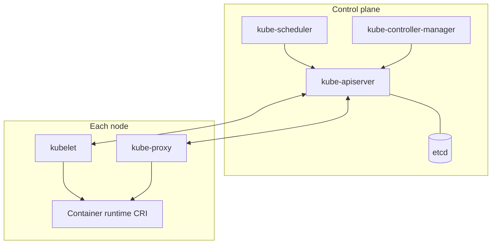

# 2.1.1 Kubernetes Components — teaching transcript

## Intro

You map **real pods in `kube-system`** and **nodes** to the mental picture: API server, etcd, scheduler, controller manager, kubelet, kube-proxy, and the container runtime.

**Prerequisites:** [Part 1](../../../part-1-getting-started/README.md); `kubectl` pointed at a cluster.

**Teaching tip:** **What happens when you run this** is below; see **WHAT THIS DOES WHEN YOU RUN IT** in `scripts/inspect-k8s-components.sh`.

**Say:**  
I am connecting names from the docs to objects I can see with `kubectl`.

## Architecture: control plane and nodes



Static pods for control-plane components often show up as Pods in `kube-system`; worker nodes run kubelet, kube-proxy, and the runtime only.

## Lab — Quick Start

**What happens when you run this:**  
- `inspect-k8s-components.sh` — lists `kube-system` pods and nodes, then hits **`/readyz?verbose`** (preferred over deprecated `componentstatuses`).  
- `kubectl get pods ...` — same namespace view you can narrow further.  
- `kubectl apply components-map.yaml` — creates/updates a **kube-system** ConfigMap (needs RBAC to write `kube-system` on some clusters).

```bash
chmod +x scripts/*.sh
./scripts/inspect-k8s-components.sh
kubectl get pods -n kube-system -o wide
kubectl apply -f yamls/components-map.yaml
```

**Expected:**  
`kube-system` shows control-plane and add-on pods; nodes list matches your environment; `components-map` applies without schema errors.

## Video close — fast validation

**What happens when you run this:**  
Nodes; `kube-system` pods; `componentstatuses` if your cluster still serves it (often deprecated) — read-only.

```bash
kubectl get nodes -o wide
kubectl get pods -n kube-system
kubectl get componentstatuses 2>/dev/null || true
```

## Repo files (reference)

| Path | Purpose |
|------|---------|
| `scripts/inspect-k8s-components.sh` | Pods, nodes, `/readyz` |
| `yamls/components-map.yaml` | Reference / teaching manifest |
| `yamls/failure-troubleshooting.yaml` | Component visibility / API issues |

## Next

[2.1.2 Objects in Kubernetes](../2.1.2-objects-in-kubernetes/README.md)
