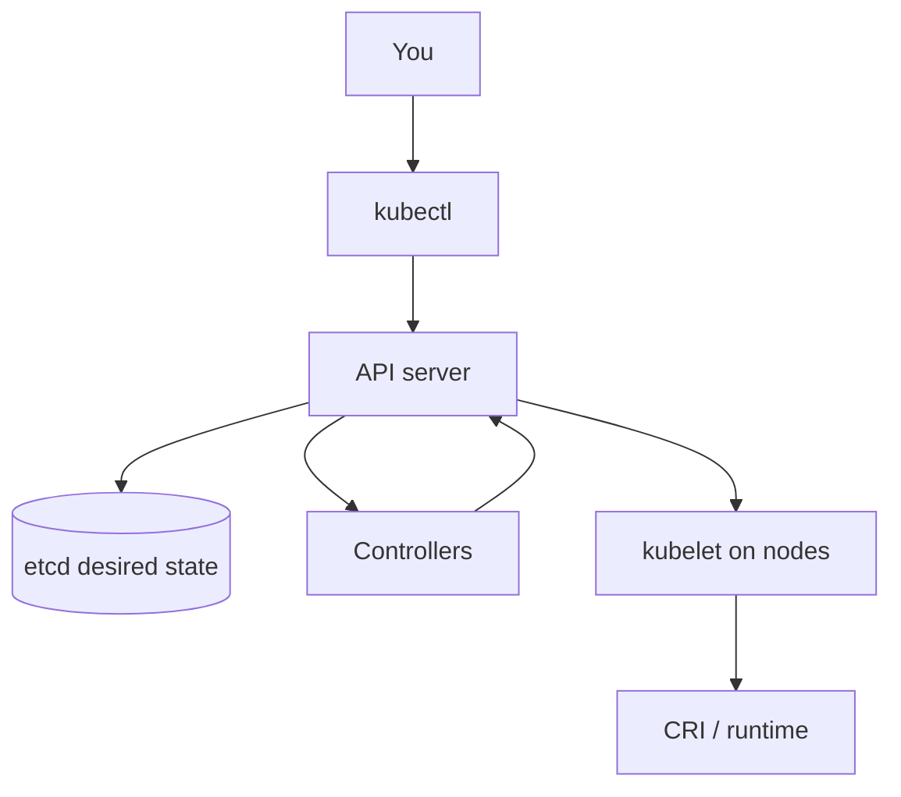

# 2.1 Overview

- **Objective**: Build the mental model for how Kubernetes represents desired state, how the API exposes it, and how `kubectl` is used to read and change that state safely.
- **Outcomes**: Name core components and their roles; describe objects, fields, and the API machinery (including discovery and versioning); run confident read-only and change workflows with `kubectl`.

**Prerequisites:** [Part 1](../../part-1-getting-started/README.md) — you need a reachable cluster and working `kubectl`.

**Teaching tip:** Sub-lessons use **What happens when you run this** before command blocks; each `scripts/*.sh` repeats the behavior in a file header.

## How this module fits the control plane



## Children (work in order)

1. [2.1.1 Kubernetes components](2.1.1-kubernetes-components/README.md)
2. [2.1.2 Objects in Kubernetes](2.1.2-objects-in-kubernetes/README.md) — subsection lessons 2.1.2.1–2.1.2.10 inside
3. [2.1.3 The Kubernetes API](2.1.3-the-kubernetes-api/README.md)
4. [2.1.4 The kubectl command-line tool](2.1.4-the-kubectl-command-line-tool/README.md)

## Module wrap — quick validation

**What happens when you run this:**  
Confirms API surface, namespaces, and a short cross-namespace listing — all read-only.

```bash
kubectl api-resources | grep -E "^configmaps|^pods|^deployments" || true
kubectl get ns
kubectl get all -A | head -n 20
```

## Next module

Continue to [2.2 Cluster architecture](../2.2-cluster-architecture/README.md).
