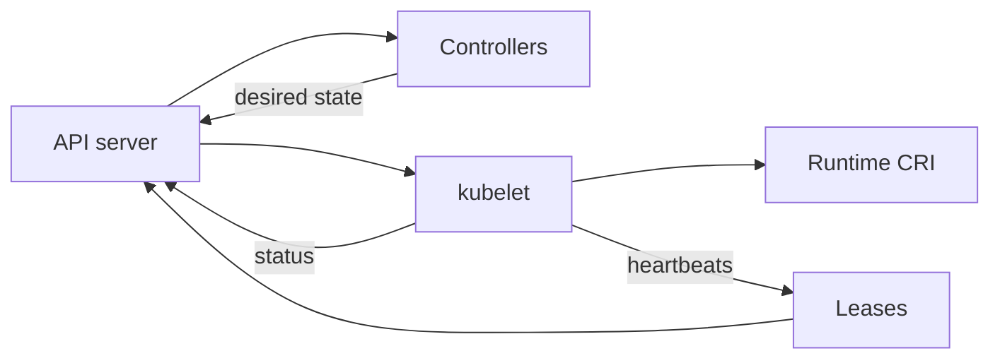

# 2.2 Cluster Architecture — teaching transcript

## Intro

Connect **nodes**, **control-plane** paths, **controllers**, **leases**, **cloud integration**, **cgroups**, **self-healing**, and **garbage collection** to what you can observe with `kubectl` (and one host check for cgroups).

**Prerequisites:** [Part 1](../../part-1-getting-started/README.md); finish [2.1 Overview](../2.1-overview/README.md) first if you want the vocabulary fresh.

**Teaching tip:** Lessons **2.2.1–2.2.8** include **What happens** + script headers where scripts exist.

## Reconciliation and node boundary



## Children (work in order)

- [2.2.1 Nodes](2.2.1-nodes/README.md)
- [2.2.2 Communication between nodes and the control plane](2.2.2-communication-between-nodes-and-the-control-plane/README.md)
- [2.2.3 Controllers](2.2.3-controllers/README.md)
- [2.2.4 Leases](2.2.4-leases/README.md)
- [2.2.5 Cloud controller manager](2.2.5-cloud-controller-manager/README.md)
- [2.2.6 About cgroup v2](2.2.6-about-cgroup-v2/README.md)
- [2.2.7 Kubernetes self-healing](2.2.7-kubernetes-self-healing/README.md)
- [2.2.8 Garbage collection](2.2.8-garbage-collection/README.md)
- [2.2.9 Mixed version proxy](2.2.9-mixed-version-proxy/README.md)

## Module wrap — quick validation

**What happens when you run this:**  
Nodes; node heartbeats (`kube-node-lease`); `kube-system` pods; recent events — read-only triage.

```bash
kubectl get nodes -o wide
kubectl get lease -n kube-node-lease
kubectl get pods -n kube-system -o wide
kubectl get events -A --sort-by=.lastTimestamp | tail -n 30
```

## Next module

[2.4 Workloads](../2.4-workloads/README.md) (per suggested course order), or open [2.3 Containers](../2.3-containers/README.md) if you prefer runtime-first.
