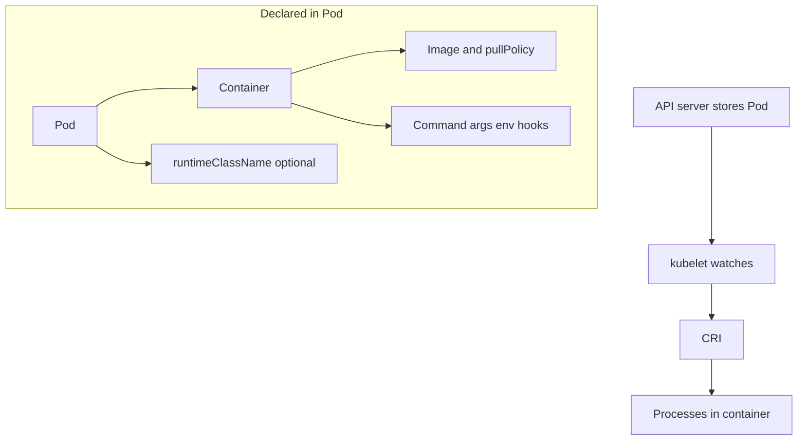

# 2.3 Containers — teaching transcript

## Intro

Go beyond “run an image”: **pull policy**, **environment assembly**, **RuntimeClass**, **lifecycle hooks**, and the **CRI** boundary between kubelet and the runtime.

**Prerequisites:** [Part 1](../../part-1-getting-started/README.md); [2.1 Overview](../2.1-overview/README.md) and [2.2 Cluster architecture](../2.2-cluster-architecture/README.md) help but are not strict gates.

**Teaching tip:** Each subsection has **What happens when you run this** before commands. The only helper script is **`inspect-cri-endpoint.sh`** (2.3.5), with **WHAT THIS DOES WHEN YOU RUN IT** in its header — run it on a **Linux node** when possible.

## From Pod spec to running container



## Children (work in order)

- [2.3.1 Images](2.3.1-images/README.md)
- [2.3.2 Container environment](2.3.2-container-environment/README.md)
- [2.3.3 Runtime class](2.3.3-runtime-class/README.md)
- [2.3.4 Container lifecycle hooks](2.3.4-container-lifecycle-hooks/README.md)
- [2.3.5 Container Runtime Interface (CRI)](2.3.5-container-runtime-interface-cri/README.md)

## Module wrap — quick validation

**What happens when you run this:**  
Nodes; sample of cluster pods; RuntimeClass list if API available — read-only.

```bash
kubectl get nodes -o wide
kubectl get pods -A | head -n 25
kubectl get runtimeclass 2>/dev/null || true
```

## Next module

[2.4 Workloads](../2.4-workloads/README.md) (suggested course order).
