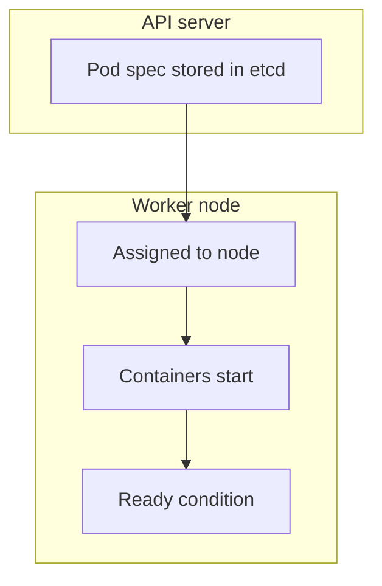

# 2.4.1.1 Pod Lifecycle — teaching transcript

## Metadata

- Duration: ~15 min
- Difficulty: Beginner
- Practical/Theory: 70/30
- Lab OS: Linux / macOS / WSL (kubectl + cluster)

## Learning objective

By the end of this lesson you will be able to:

- Read **`.status.phase`** and **Pod conditions** and relate them to scheduling and container startup.
- Distinguish **Kubernetes-level readiness** from **application health** (probes build the bridge; this lesson focuses on status fields).
- Use `kubectl describe` and **events** to explain why a Pod is not `Ready`.

## Why this matters in real jobs

Incidents often start as “pod not ready.” On-call engineers read phase, conditions, and the event stream before touching the app. Confusing **CrashLoopBackOff** with a **scheduling** problem wastes minutes.

## Prerequisites

- [Part 2 prerequisites](../../../README.md#prerequisites-met-read-this-before-21)
- Optional: [1.1.3 dev-local workspace](../../../../part-1-getting-started/1.1-learning-environment/1.1.3-local-development-clusters/README.md) if you use a dedicated namespace (`NS=dev-local` works with the verify script)

## Concepts (short theory)

- **Phase** (`Pending`, `Running`, `Succeeded`, `Failed`, `Unknown`) is a high-level summary; it can mislead if a container is running but not ready.
- **Conditions** such as `PodScheduled`, `Initialized`, `ContainersReady`, and `Ready` carry the detailed truth; `Ready=True` is what Services use for endpoints.
- **restartPolicy** (`Always`, `OnFailure`, `Never`) defines kubelet behavior when containers exit; it interacts with probe failures in real apps (demo uses a simple sleep loop).

## Visual — lifecycle and signals



## Lab — Quick Start

**What happens when you run this:**  
`apply` creates a Pod in `default` (or your current namespace). The scheduler places it; kubelet pulls `busybox:1.36`, starts `sleep 3600`, then the kubelet sets **Ready** once the container is running and any probes pass (none configured here — readiness follows container running).

```bash
kubectl apply -f yamls/pod-lifecycle-demo.yaml
kubectl wait --for=condition=Ready pod/pod-lifecycle-demo --timeout=120s
kubectl get pod pod-lifecycle-demo -o wide
```

**Expected:** `PHASE=Running`, `READY=1/1`, node name populated.

**Verify (after lab):**

```bash
chmod +x scripts/verify-pod-lifecycle-lesson.sh
./scripts/verify-pod-lifecycle-lesson.sh
# Other namespace: NS=dev-local ./scripts/verify-pod-lifecycle-lesson.sh
```

## Transcript — 10-minute narrative

### Hook

You already know how to create a cluster. Now you watch one object go from **intent** in YAML to **signals** in status. Those signals are what Grafana alerts and `kubectl` share.

### Phase vs conditions

**Say:** Phase is the headline; conditions are the paragraphs. A Pod can be `Running` while `Ready=False` if readiness probes fail — you will see that pattern once probes are introduced in your apps.

### Reading describe

**Say:** Events at the bottom of `describe` are append-only clues: image pull failures, scheduling denials, volume mount errors. Start there before you grep application logs.

### Cleanup (optional)

```bash
kubectl delete -f yamls/pod-lifecycle-demo.yaml --ignore-not-found
```

## Video close — fast validation

**What happens when you run this:**  
Wide columns show node placement; the `sed` slice shows the **Conditions** block for teaching review.

```bash
kubectl get pod pod-lifecycle-demo -o wide
kubectl describe pod pod-lifecycle-demo | sed -n '/Conditions:/,/Events:/p'
```

## Repo files (reference)

| Path | Purpose |
|------|---------|
| `yamls/pod-lifecycle-demo.yaml` | Single-container demo Pod |
| `yamls/failure-troubleshooting.yaml` | Common failure patterns for drills |
| `scripts/verify-pod-lifecycle-lesson.sh` | Confirms Pod exists and `Ready=True` |

## Failure troubleshooting asset

- `yamls/failure-troubleshooting.yaml` — pod phase, probe, and scheduling failures.

## Next

[2.4.1.2 Init Containers](../2.4.1.2-init-containers/README.md)
