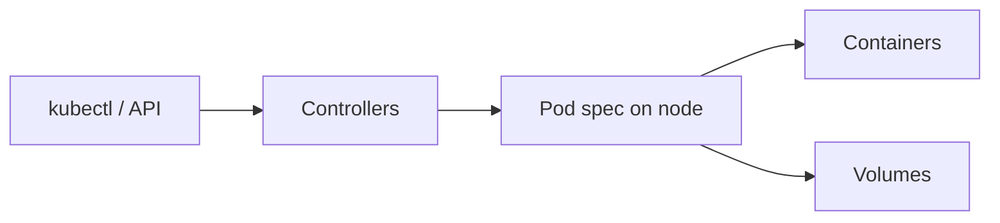

# 2.4.1 Pods

A **Pod** is the smallest deployable unit on Kubernetes: one or more containers that share network and storage namespaces on a node. Everything “higher level” (Deployments, Jobs, …) ultimately creates or replaces Pods.

**Prerequisites:** [2.4 module](../README.md); working cluster.

## How this subsection fits (diagram)



## Children (suggested order)

1. [2.4.1.1 Pod Lifecycle](2.4.1.1-pod-lifecycle/README.md) — **start here** (phases, conditions, verify script).
2. [2.4.1.2 Init Containers](2.4.1.2-init-containers/README.md)
3. [2.4.1.3 Sidecar Containers](2.4.1.3-sidecar-containers/README.md)
4. [2.4.1.4 Ephemeral Containers](2.4.1.4-ephemeral-containers/README.md)
5. [2.4.1.5 Disruptions](2.4.1.5-disruptions/README.md)
6. [2.4.1.6 Pod Hostname](2.4.1.6-pod-hostname/README.md)
7. [2.4.1.7 Pod Quality of Service Classes](2.4.1.7-pod-quality-of-service-classes/README.md)
8. [2.4.1.8 Workload Reference](2.4.1.8-workload-reference/README.md)
9. [2.4.1.9 User Namespaces](2.4.1.9-user-namespaces/README.md)
10. [2.4.1.10 Downward API](2.4.1.10-downward-api/README.md)
11. [2.4.1.11 Advanced Pod Configuration](2.4.1.11-advanced-pod-configuration/README.md)

## Module wrap — quick validation

```bash
kubectl get pods -A | head -n 30
kubectl get pdb -A 2>/dev/null || true
kubectl get events -A --sort-by=.lastTimestamp | tail -n 20
```

## Next subsection

[2.4.2 Workload API](../2.4.2-workload-api/README.md) or continue into [2.4.3 Workload Management](../2.4.3-workload-management/README.md) if you prefer controllers first.
