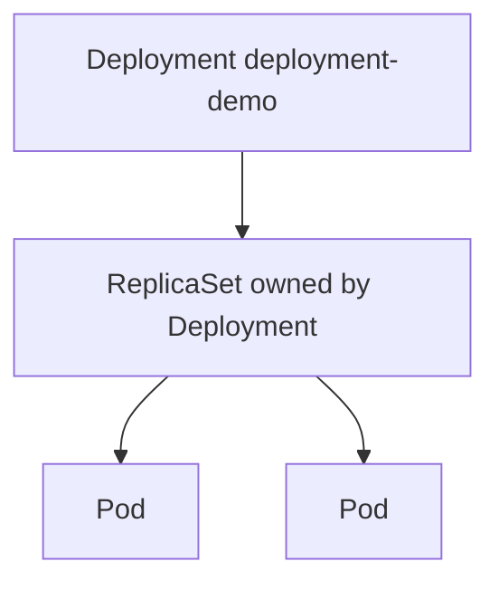

# 2.4.3.1 Deployments — teaching transcript

## Metadata

- Duration: ~15 min
- Difficulty: Beginner
- Practical/Theory: 70/30

## Learning objective

By the end of this lesson you will be able to:

- Create a **Deployment**, watch a **rollout** reach available state, and list **ReplicaSets** owned by that Deployment.
- Use **`kubectl rollout history`** as a first step before rollback discussions.
- Explain why **changing the pod template** creates a new ReplicaSet instead of patching old pods in place.

## Why this matters in real jobs

Most stateless services run behind Deployments. Rollouts, image bumps, and “replicas stuck at 0” tickets all show up through Deployment and ReplicaSet status. This is the default mental model for **Kubernetes-native** apps.

## Prerequisites

- [2.4.1.1 Pod Lifecycle](../../2.4.1-pods/2.4.1.1-pod-lifecycle/README.md) recommended

## Concepts (short theory)

- A **Deployment** declares desired replicas and a **pod template**; the **Deployment controller** creates/updates a **ReplicaSet** whose job is to keep matching Pods running.
- Template changes roll forward through a **new ReplicaSet** (usually) while scaling events adjust replica counts — you see multiple ReplicaSets during rolling updates.
- **Available** means ready pods meet minimum availability rules configured on the Deployment (defaults allow your pods to become endpoints).

## Visual — Deployment → ReplicaSet → Pods



## Lab — Quick Start

**What happens when you run this:**  
The Deployment controller creates a ReplicaSet, which creates two Pods from the template (`nginx:1.27`). `rollout status` blocks until the Deployment’s **availableReplicas** match **spec.replicas**.

```bash
kubectl apply -f yamls/deployment-demo.yaml
kubectl rollout status deployment/deployment-demo --timeout=120s
kubectl get deploy,pods -l app=deployment-demo
kubectl get rs -l app=deployment-demo
```

**Expected:** `AVAILABLE` equals desired (2), two pods `Running` and `READY`, one primary ReplicaSet with desired=2.

**Verify:**

```bash
chmod +x scripts/verify-deployments-lesson.sh
./scripts/verify-deployments-lesson.sh
```

## Transcript — short narrative

### Hook

You stopped hand-crafting single Pods. A Deployment says: “keep N copies of this template.” Kubernetes does the churn when nodes die or images change.

### ReplicaSet is implementation detail

**Say:** You rarely edit ReplicaSets directly in production; you change the Deployment. For debugging, `kubectl describe deploy` links you to the active ReplicaSet and its events.

### History

**Say:** `rollout history` records revision metadata. Real rollbacks use `kubectl rollout undo` (covered when you change images in a later exercise); history is the audit trail.

### Cleanup (optional)

```bash
kubectl delete -f yamls/deployment-demo.yaml --ignore-not-found
```

## Video close — fast validation

**What happens when you run this:**  
Deployment-wide view plus revision list — read-only confirmation after changes.

```bash
kubectl get deploy deployment-demo -o wide
kubectl rollout history deployment/deployment-demo
```

## Repo files (reference)

| Path | Purpose |
|------|---------|
| `yamls/deployment-demo.yaml` | Two-replica nginx Deployment |
| `yamls/failure-troubleshooting.yaml` | Rollout and image failures |
| `scripts/verify-deployments-lesson.sh` | Waits for Available; checks replica counts |

## Failure troubleshooting asset

- `yamls/failure-troubleshooting.yaml` — rollout, image pull, selector mismatches.

## Next

[2.4.3.2 ReplicaSet](../2.4.3.2-replicaset/README.md)
