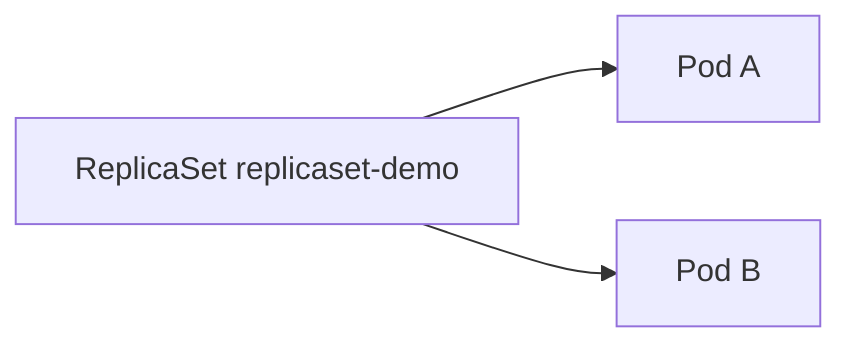

# 2.4.3.2 ReplicaSet — teaching transcript

## Metadata

- Duration: ~12 min
- Difficulty: Beginner
- Practical/Theory: 65/35

## Learning objective

By the end of this lesson you will be able to:

- Create a **ReplicaSet** directly and see it **own** Pods via labels.
- Contrast that with a **Deployment-owned** ReplicaSet (from 2.4.3.1): who writes the ReplicaSet, and who is allowed to change pod templates.
- Read **`.spec.selector`** and understand why selector immutability matters when labels drift.

## Why this matters in real jobs

You almost always use Deployments, but incidents surface **ReplicaSet** objects: orphaned ReplicaSets after bad rollouts, selector clashes, or manual `kubectl delete pod` churn. Knowing the controller’s job separates platform issues from app issues.

## Prerequisites

- [2.4.3.1 Deployments](../2.4.3.1-deployments/README.md)

## Concepts (short theory)

- A **ReplicaSet** ensures **n** Pods exist matching its **label selector**; it creates/deletes Pods to match.
- **Deployments** manage ReplicaSets for you and handle rolling updates; a standalone ReplicaSet has **no rollout** — template changes are awkward (often delete/recreate).
- **Selector** is effectively immutable in normal workflows; changing labels on running Pods without updating the selector causes **orphans** or **surprise duplicates**.

## Visual — direct ownership



## Lab — Quick Start

**What happens when you run this:**  
You apply a ReplicaSet with `replicas: 2`. The controller creates two Pods labeled `app=replicaset-demo`. There is **no** Deployment in this manifest — you are exercising the lower layer.

```bash
kubectl apply -f yamls/replicaset-demo.yaml
kubectl get rs replicaset-demo
kubectl get pods -l app=replicaset-demo -o wide
kubectl describe rs replicaset-demo | sed -n '/Replicas:/,/Events:/p'
```

**Expected:** `DESIRED` = `CURRENT` = `READY` = 2; two pods on nodes (placement varies).

**Verify:**

```bash
chmod +x scripts/verify-replicaset-lesson.sh
./scripts/verify-replicaset-lesson.sh
```

## Transcript — short narrative

### Hook

Last lesson used a Deployment. Underneath, Kubernetes still used a ReplicaSet. This time you drive the ReplicaSet yourself to feel what the Deployment automates away.

### When standalone ReplicaSets appear

**Say:** Legacy migrations, demos, or operators sometimes create ReplicaSets. Production microservices should default to Deployments so you get rollouts and history.

### Cleanup (optional)

```bash
kubectl delete -f yamls/replicaset-demo.yaml --ignore-not-found
```

**Note:** If you still have **deployment-demo** from the previous lesson, it is unrelated — different label keys/values. Both can coexist in `default`.

## Video close — fast validation

```bash
kubectl describe rs replicaset-demo | sed -n '/Replicas:/,/Pod Status:/p'
kubectl get pods -l app=replicaset-demo -o wide
```

## Repo files (reference)

| Path | Purpose |
|------|---------|
| `yamls/replicaset-demo.yaml` | Two-replica nginx ReplicaSet |
| `yamls/failure-troubleshooting.yaml` | Selector and orphan scenarios |
| `scripts/verify-replicaset-lesson.sh` | Checks replica and ready counts |

## Failure troubleshooting asset

- `yamls/failure-troubleshooting.yaml` — selector overlap and orphan pods.

## Next

[2.4.3.3 StatefulSets](../2.4.3.3-statefulsets/README.md)
