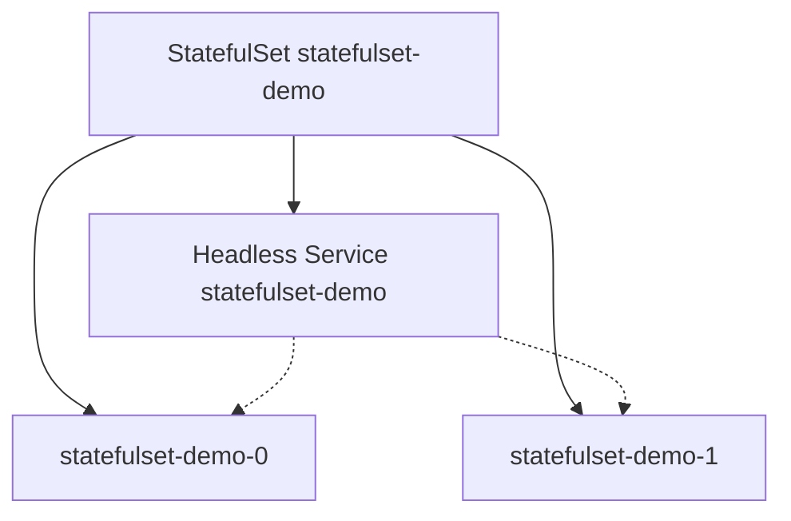

# 2.4.3.3 StatefulSets — teaching transcript

## Metadata

- Duration: ~18 min
- Difficulty: Intermediate
- Practical/Theory: 65/35

## Learning objective

By the end of this lesson you will be able to:

- Explain **stable network identity** for Pods created by a StatefulSet (pod name ordinals, headless Service DNS).
- Contrast **ordered** creation/termination with Deployment-style **parallel** churn.
- Read StatefulSet status alongside a **headless Service** (`clusterIP: None`) used for per-pod DNS.

## Why this matters in real jobs

Databases, Kafka brokers, and other clustered stateful systems rely on **predictable names** and often on **per-instance DNS**. StatefulSet is the standard controller for that pattern on Kubernetes (often combined with PVCs — this demo omits volumes to keep the lab minimal).

## Prerequisites

- [2.4.3.2 ReplicaSet](../2.4.3.2-replicaset/README.md)
- [2.4.1.1 Pod Lifecycle](../../2.4.1-pods/2.4.1.1-pod-lifecycle/README.md) recommended

## Concepts (short theory)

- **`serviceName`** ties the StatefulSet to a Service that governs **network identity**; for stable DNS per pod, that Service is usually **headless** (`clusterIP: None`).
- Pods are named **`{statefulset-name}-{ordinal}`** and start/stop in order by default (scale-up creates `…-0` before `…-1`).
- **Parallel pod management** can be enabled for faster startups when ordering is not required — not used in this demo.

## Visual — identity and Service



## Lab — Quick Start

**What happens when you run this:**  
The manifest applies a **headless Service** and a **StatefulSet** with `replicas: 2`. The controller creates `statefulset-demo-0`, waits for it to be ready (default policy), then creates `statefulset-demo-1`. Each pod gets a stable hostname derived from the pod name inside the cluster DNS zone.

```bash
kubectl apply -f yamls/statefulset-demo.yaml
kubectl rollout status statefulset/statefulset-demo --timeout=180s
kubectl get pods -l app=statefulset-demo -o wide
```

**Expected:** Two pods `Running`, names ending in `-0` and `-1`, both `READY`.

**Verify:**

```bash
chmod +x scripts/verify-statefulset-lesson.sh
./scripts/verify-statefulset-lesson.sh
```

## Transcript — short narrative

### Hook

Deployments replace Pods freely; names are disposable. StatefulSets **keep** names and order so peers can find each other — “broker-0 always means the same ordinal.”

### Headless Service

**Say:** A normal ClusterIP Service load-balances to backends. A headless Service returns **A records for each ready endpoint** — clients resolve individual pod IPs. That pairs with StatefulSet for discovery patterns you will see in Helm charts for databases.

### No PVC in this demo

**Say:** Production StatefulSets almost always use **`volumeClaimTemplates`**. This lesson keeps storage out so you focus on **identity and rollout**. Add PVCs when you are ready to practice resize and storage class constraints.

### Cleanup (optional)

```bash
kubectl delete -f yamls/statefulset-demo.yaml --ignore-not-found
```

**Note:** Wait for pods to terminate before re-applying the same names, or you may see transient conflicts on rapid re-create.

## Video close — fast validation

**What happens when you run this:**  
Lists the StatefulSet, headless Service, and ordinal pods — read-only sanity check.

```bash
kubectl get sts,svc statefulset-demo
kubectl get pods -l app=statefulset-demo -o wide
```

## Repo files (reference)

| Path | Purpose |
|------|---------|
| `yamls/statefulset-demo.yaml` | Headless Service + 2-replica StatefulSet (nginx) |
| `yamls/failure-troubleshooting.yaml` | PVC/DNS/ordering drills |
| `scripts/verify-statefulset-lesson.sh` | Rollout + ordinal pod names + headless hint |

## Failure troubleshooting asset

- `yamls/failure-troubleshooting.yaml` — PVC, DNS, ordered startup issues.

## Next

[2.4.3.4 DaemonSet](../2.4.3.4-daemonset/README.md)
