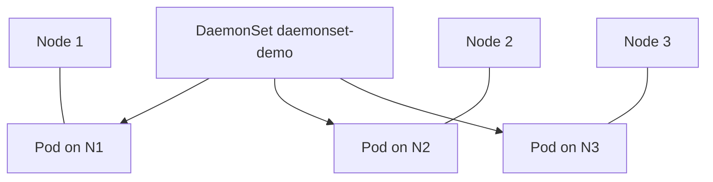

# 2.4.3.4 DaemonSet — teaching transcript

## Metadata

- Duration: ~15 min
- Difficulty: Beginner
- Practical/Theory: 70/30

## Learning objective

By the end of this lesson you will be able to:

- Explain why a DaemonSet runs **one matching pod per schedulable node** (and how that differs from “replicas: N”).
- Relate DaemonSets to **node agents**: log shippers, monitoring exporters, CNI plugins, device plugins.
- Use `kubectl rollout status` and DaemonSet **status counters** to confirm cluster-wide placement.

## Why this matters in real jobs

Platform teams ship many cluster add-ons as DaemonSets. When a node **taints** or goes **NotReady**, DaemonSet pods are the canary for “can this node run workloads?”

## Prerequisites

- [2.4.3.3 StatefulSet](../2.4.3.3-statefulsets/README.md)

## Concepts (short theory)

- The DaemonSet controller **targets nodes**, not a fixed replica count: `desiredNumberScheduled` follows the set of nodes that match affinity, tolerations, and scheduling rules.
- **Updates** roll pod-by-pod (maxUnavailable / maxSurge depend on API version and feature gates); `kubectl rollout status` tracks that progression.
- **Taints and tolerations** commonly block DaemonSet pods on control-plane nodes unless the chart adds the right toleration — compare your pod list to `kubectl get nodes`.

## Visual — one pod per node



## Lab — Quick Start

**What happens when you run this:**  
DaemonSet creates a `busybox` sleep pod on **each node that accepts the pod**. On Minikube or single-node Kind you will see **one** pod; on three worker nodes you expect **three**.

```bash
kubectl apply -f yamls/daemonset-demo.yaml
kubectl rollout status daemonset/daemonset-demo --timeout=180s
kubectl get pods -l app=daemonset-demo -o wide
```

**Expected:** Pod count equals **schedulable** nodes in your cluster (often 1 in local labs).

**Verify:**

```bash
chmod +x scripts/verify-daemonset-lesson.sh
./scripts/verify-daemonset-lesson.sh
```

## Transcript — short narrative

### Hook

Deployments ask “how many copies?” DaemonSets ask “on **which** machines should this agent run?” The answer is usually **all of them** that match policy.

### Single-node labs

**Say:** Do not expect three pods on Minikube — expect **desiredNumberScheduled == 1**. The verify script checks that **desired, current, and ready** match, not a magic number.

### Cleanup (optional)

```bash
kubectl delete -f yamls/daemonset-demo.yaml --ignore-not-found
```

## Video close — fast validation

```bash
kubectl get ds daemonset-demo
kubectl get pods -l app=daemonset-demo -o wide
kubectl get nodes -o wide
```

## Repo files (reference)

| Path | Purpose |
|------|---------|
| `yamls/daemonset-demo.yaml` | Minimal DaemonSet (busybox sleep) |
| `yamls/failure-troubleshooting.yaml` | Taints, selectors, placement |
| `scripts/verify-daemonset-lesson.sh` | Rollout + desired/current/ready equality |

## Failure troubleshooting asset

- `yamls/failure-troubleshooting.yaml` — taint/toleration and node selector mismatches.

## Next

[2.4.3.5 Jobs](../2.4.3.5-jobs/README.md)
