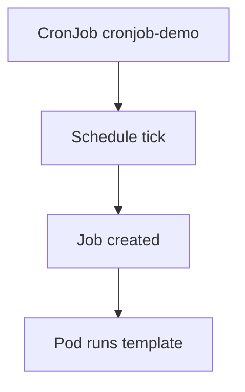

# 2.4.3.7 CronJob — teaching transcript

## Metadata

- Duration: ~15 min
- Difficulty: Intermediate
- Practical/Theory: 60/40

## Learning objective

By the end of this lesson you will be able to:

- Read a **cron schedule** in Kubernetes (`min hour dom mon dow`) and relate it to **controller time** (usually **kube-controller-manager** timezone: **UTC** unless configured otherwise).
- Explain **`concurrencyPolicy`**: `Allow`, `Forbid`, or `Replace` when the previous Job is still running.
- Create a **one-off Job** from a CronJob with **`kubectl create job ... --from=cronjob/...`** to test the template without waiting for the schedule.

## Why this matters in real jobs

CronJobs power backups, reports, and sync jobs. Incidents show up as **missed schedules** (`startingDeadlineSeconds`), **overlapping runs** (wrong concurrency policy), or **zombie Job lists** (history limits too high).

## Prerequisites

- [2.4.3.6 Automatic cleanup for finished Jobs](../2.4.3.6-automatic-cleanup-for-finished-jobs/README.md)

## Concepts (short theory)

- The **schedule** field uses the same five fields as standard cron; the controller creates a **Job** object for each firing.
- **`suspend: true`** stops new Jobs — useful for maintenance without deleting the CronJob.
- **`successfulJobsHistoryLimit` / `failedJobsHistoryLimit`** trim how many finished Jobs remain listed (distinct from **TTL** on individual Jobs).

## Visual — CronJob → Job → Pod



## Lab — Quick Start

**What happens when you run this:**  
The CronJob is installed with **`*/1 * * * *`** (every minute) and **`concurrencyPolicy: Forbid`** so a slow previous run blocks a second one. Within a minute you should see new Jobs appear; use **watch** to learn the rhythm.

```bash
kubectl apply -f yamls/cronjob-demo.yaml
kubectl get cronjob cronjob-demo
kubectl describe cronjob cronjob-demo | sed -n '1,45p'
# In another terminal (optional):
# kubectl get jobs -w
```

**Instant template check (no schedule wait):**

```bash
kubectl create job cj-manual-test --from=cronjob/cronjob-demo
kubectl wait --for=condition=complete job/cj-manual-test --timeout=120s
kubectl logs job/cj-manual-test
kubectl delete job cj-manual-test --ignore-not-found
```

**Verify (creates and deletes a short-lived Job automatically):**

```bash
chmod +x scripts/verify-cronjob-lesson.sh
./scripts/verify-cronjob-lesson.sh
```

## Transcript — short narrative

### Hook

Humans think in local time; the cluster often thinks in **UTC**. Always confirm **where** the control plane runs and whether your platform overrides CM timezone — wrong assumption equals “it never fired.”

### Forbid vs Allow

**Say:** **Forbid** is safest for jobs that must not overlap (single-writer migrations). **Allow** stacks runs — can overload downstream systems.

### Cleanup (optional)

```bash
kubectl delete -f yamls/cronjob-demo.yaml --ignore-not-found
kubectl delete job cj-manual-test --ignore-not-found
```

Delete any leftover **`cj-verify-*`** Jobs if you interrupted `verify-cronjob-lesson.sh` before it finished.

## Video close — fast validation

```bash
kubectl get cronjob
kubectl get jobs --sort-by=.metadata.creationTimestamp | tail -n 8
```

## Repo files (reference)

| Path | Purpose |
|------|---------|
| `yamls/cronjob-demo.yaml` | Every-minute CronJob, `Forbid`, history limits |
| `yamls/failure-troubleshooting.yaml` | Schedule, timezone, concurrency issues |
| `scripts/verify-cronjob-lesson.sh` | `--from=cronjob` one-shot Job + log sanity |

## Failure troubleshooting asset

- `yamls/failure-troubleshooting.yaml` — schedule syntax, deadline, concurrency.

## Next

[2.4.3.8 ReplicationController](../2.4.3.8-replicationcontroller/README.md)
