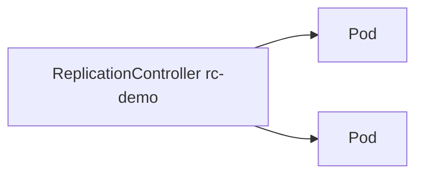

# 2.4.3.8 ReplicationController — teaching transcript

## Metadata

- Duration: ~10 min
- Difficulty: Beginner
- Practical/Theory: 50/50 (history + small lab)

## Learning objective

By the end of this lesson you will be able to:

- Describe **ReplicationController** as the **v1** predecessor to **ReplicaSet** (`apps/v1`).
- Explain why new work should use **Deployment → ReplicaSet**, not raw RC.
- Compare **RC selector** behavior with **ReplicaSet** (both label-based; RC is legacy API).

## Why this matters in real jobs

You still find **ReplicationControllers** in old clusters, generated YAML from ancient tutorials, or vendor samples. Recognizing `kind: ReplicationController` tells you **migration** may be overdue — it is not a style preference, it is **technical debt**.

## Prerequisites

- [2.4.3.2 ReplicaSet](../2.4.3.2-replicaset/README.md) (recommended before or after — compare mentally)
- [2.4.3.7 CronJob](../2.4.3.7-cronjob/README.md)

## Concepts (short theory)

- **ReplicaSet** added **set-based selectors** and lives under **`apps/v1`**; **Deployment** manages ReplicaSets.
- **ReplicationController** only supports **equality-based** selectors in practice; it cannot express richer set semantics.
- **kubectl** short name is **`rc`** — `kubectl get rc` still works on many clusters.

## Visual — legacy single layer



## Lab — Quick Start

**What happens when you run this:**  
You apply a v1 **ReplicationController** with two nginx replicas. Behavior feels like a ReplicaSet: it ensures two pods with **`app=rc-demo`**. The difference is API group, history, and ecosystem support — not day-one pod behavior.

```bash
kubectl apply -f yamls/replicationcontroller-demo.yaml
kubectl get rc rc-demo
kubectl get pods -l app=rc-demo -o wide
```

**Verify:**

```bash
chmod +x scripts/verify-replicationcontroller-lesson.sh
./scripts/verify-replicationcontroller-lesson.sh
```

## Transcript — short narrative

### Hook

If someone says “we use ReplicationControllers in production,” your first question is **why** — and your second is **what migration path** to Deployment exists.

### Side-by-side

**Say:** Open [2.4.3.2 ReplicaSet](../2.4.3.2-replicaset/README.md) and compare: two nginx pods, label selector, same operational outcome — different **API** and **future**.

### Cleanup (optional)

```bash
kubectl delete -f yamls/replicationcontroller-demo.yaml --ignore-not-found
```

## Video close — fast validation

```bash
kubectl describe rc rc-demo | sed -n '/Replicas:/,/Pod Status:/p'
kubectl get pods -l app=rc-demo -o wide
```

## Repo files (reference)

| Path | Purpose |
|------|---------|
| `yamls/replicationcontroller-demo.yaml` | Two-replica nginx RC |
| `yamls/failure-troubleshooting.yaml` | Legacy pitfalls / migration |
| `scripts/verify-replicationcontroller-lesson.sh` | Replica / ready count check |

## Failure troubleshooting asset

- `yamls/failure-troubleshooting.yaml` — legacy RC issues and Deployment migration.

## Next

[2.4.4 Managing Workloads](../../2.4.4-managing-workloads/README.md)
