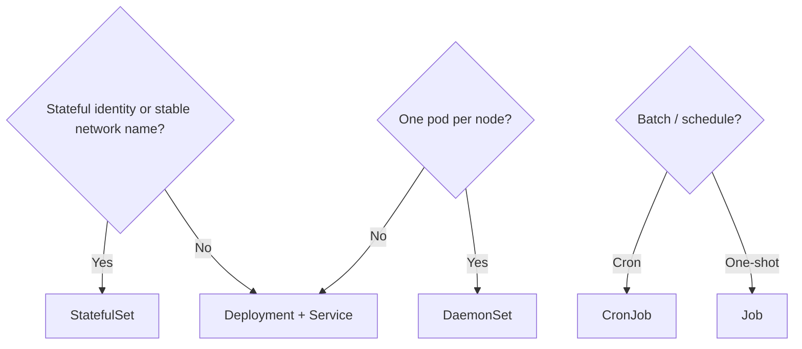

# 2.4.3 Workload Management

Controllers turn **desired state** into **running Pods**. Each controller optimizes for different guarantees: stateless scale-out, stable identity, per-node daemons, or batch completion.

**Prerequisites:** [2.4.1.1 Pod Lifecycle](../2.4.1-pods/2.4.1.1-pod-lifecycle/README.md) recommended so Pod phases and conditions are fresh.

## Controller choice (diagram)



## Children (suggested order)

1. [2.4.3.1 Deployments](2.4.3.1-deployments/README.md) — **default stateless app** (transcript + verify).
2. [2.4.3.2 ReplicaSet](2.4.3.2-replicaset/README.md) — what Deployments own under the hood (transcript + verify).
3. [2.4.3.3 StatefulSets](2.4.3.3-statefulsets/README.md) — transcript + `scripts/verify-statefulset-lesson.sh`
4. [2.4.3.4 DaemonSet](2.4.3.4-daemonset/README.md) — transcript + `scripts/verify-daemonset-lesson.sh`
5. [2.4.3.5 Jobs](2.4.3.5-jobs/README.md) — transcript + `scripts/verify-jobs-lesson.sh`
6. [2.4.3.6 Automatic Cleanup for Finished Jobs](2.4.3.6-automatic-cleanup-for-finished-jobs/README.md) — transcript + `scripts/verify-job-ttl-lesson.sh` (waits for TTL deletion)
7. [2.4.3.7 CronJob](2.4.3.7-cronjob/README.md) — transcript + `scripts/verify-cronjob-lesson.sh` (`kubectl create job --from=cronjob/...`)
8. [2.4.3.8 ReplicationController](2.4.3.8-replicationcontroller/README.md) — transcript + `scripts/verify-replicationcontroller-lesson.sh`

## Module wrap — quick validation

```bash
kubectl get deploy,sts,ds,job,cronjob,rc -A 2>/dev/null | head -n 40
kubectl get pods -A | head -n 25
```

## Next

[2.4.4 Managing Workloads](../2.4.4-managing-workloads/README.md)
