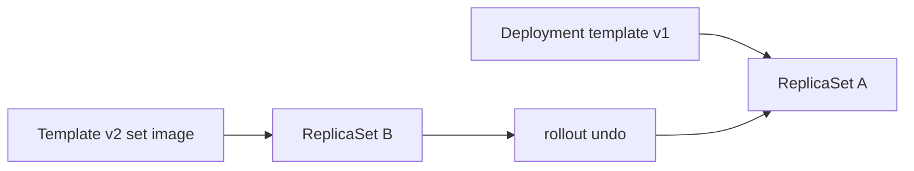

# 2.4.4 Managing Workloads — teaching transcript

## Metadata

- Duration: ~20 min
- Difficulty: Beginner
- Practical/Theory: 80/20

## Learning objective

By the end of this lesson you will be able to:

- **Scale** a Deployment, **watch** rollout status, and read **`kubectl rollout history`**.
- Trigger a **new revision** with **`kubectl set image`** and **undo** with **`kubectl rollout undo`**.
- Relate each step to **ReplicaSets** underneath (from [2.4.3.1](../2.4.3-workload-management/2.4.3.1-deployments/README.md)).

## Why this matters in real jobs

Day-2 work is rarely “write YAML once.” It is **image bumps**, **emergency rollback**, **scale for traffic**, and **paused rollouts** during freezes. This lesson wires those verbs to **observable** cluster state.

## Prerequisites

- [2.4.3.1 Deployments](../2.4.3-workload-management/2.4.3.1-deployments/README.md)

## Concepts (short theory)

- **`kubectl rollout status`** blocks until the Deployment controller reports success for the current change — not the same as “all pods healthy forever.”
- **`kubectl set image`** updates the **pod template** → new **ReplicaSet** → rolling replacement of Pods (default strategy).
- **`kubectl rollout undo`** moves the Deployment back to the **previous** template revision — know your **history** before relying on it in production.

## Visual — change → new RS → rollback



## Lab — Quick Start

**What happens when you run this:**  
`manage-workloads-demo.sh` applies a **2-replica** nginx Deployment, **scales to 3**, bumps the image **1.27 → 1.26** (intentional drift for teaching), prints **history**, then **undoes** so you end on **nginx:1.27** again with **3** replicas.

```bash
chmod +x scripts/manage-workloads-demo.sh scripts/verify-manage-workloads-lesson.sh
./scripts/manage-workloads-demo.sh
```

**Verify:**

```bash
./scripts/verify-manage-workloads-lesson.sh
```

**Repeat from scratch (optional):**

```bash
kubectl delete deployment manage-workloads-demo --ignore-not-found
./scripts/manage-workloads-demo.sh
```

## Transcript — short narrative

### Hook

YAML checked in to Git is static; the cluster is **live**. Operators use imperative commands when speed matters — then backport the manifest so Git matches reality.

### History is not infinite audit

**Say:** `rollout history` keeps **revision** metadata; for deep audits use **Git**, **image registry**, and **change tickets** — not kubectl alone.

### Pause (homework)

**Say:** `kubectl rollout pause deployment/...` freezes ReplicaSet churn during risky windows; pair with **canary** patterns in advanced courses.

## Video close — fast validation

```bash
kubectl get deploy manage-workloads-demo -o wide
kubectl rollout history deployment/manage-workloads-demo
kubectl get rs -l app=manage-workloads-demo
kubectl get pods -l app=manage-workloads-demo -o wide
```

## Repo files (reference)

| Path | Purpose |
|------|---------|
| `yamls/manage-workloads-demo.yaml` | Baseline Deployment (nginx:1.27, replicas: 2) |
| `scripts/manage-workloads-demo.sh` | Scale, image change, history, undo |
| `scripts/verify-manage-workloads-lesson.sh` | Post-demo assertions |
| `yamls/failure-troubleshooting.yaml` | Rollout pause, scaling, rollback drills |

## Failure troubleshooting asset

- `yamls/failure-troubleshooting.yaml` — rollout pause, scaling, rollback failures.

## Next

[2.5 Services, Load Balancing, and Networking](../../2.5-services-load-balancing-and-networking/README.md)
