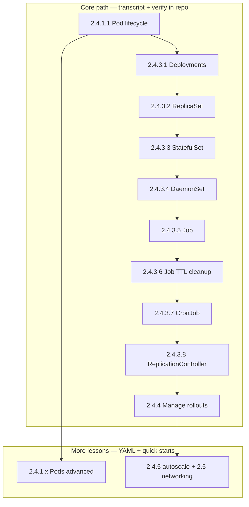

# 2.4 Workloads

Workloads are how you tell Kubernetes **what should be running** and **how many**. The API accepts your intent; controllers reconcile toward it. This module moves from the **Pod** (smallest unit) through **ReplicaSets** and **Deployments**, then onward to StatefulSets, DaemonSets, and Jobs in later lessons.

**Prerequisites:** [Part 2 entry check](../README.md#prerequisites-met-read-this-before-21) — `kubectl cluster-info` and `/readyz` must work.

**Tested-on note:** Demos use `busybox` and `nginx` public images; compatible with any recent supported Kubernetes (see [`KUBERNETES_VERSION_MATRIX.md`](../../KUBERNETES_VERSION_MATRIX.md)).

## Learning path (diagram)



## Children

- [2.4.1 Pods](2.4.1-pods/README.md)
- [2.4.2 Workload API](2.4.2-workload-api/README.md)
- [2.4.3 Workload Management](2.4.3-workload-management/README.md)
- [2.4.4 Managing Workloads](2.4.4-managing-workloads/README.md)
- [2.4.5 Autoscaling Workloads](2.4.5-autoscaling-workloads/README.md)

## Module verification

From this directory:

```bash
bash scripts/verify-2-4-workloads-module.sh
```

After you apply the YAMLs / run the scripts for the **core path** (through **2.4.4**), run:

```bash
bash scripts/verify-2-4-workloads-module.sh --labs
```

(`--labs` includes **Job TTL wait** and expects **`manage-workloads-demo.sh`** to have been run so the Deployment is at **3** replicas and **nginx:1.27**.)

## Module wrap — quick validation

**What happens when you run this:** Read-only inventory of workload controllers and pods; useful after any rollout or failure drill.

```bash
kubectl get deploy,sts,ds,job,cronjob,hpa -A 2>/dev/null | head -n 40
kubectl get pods -A | head -n 30
kubectl get events -A --sort-by=.lastTimestamp | tail -n 25
```

## Next

[2.5 Services, Load Balancing, and Networking](../2.5-services-load-balancing-and-networking/README.md) — connect workloads to stable network identities.
