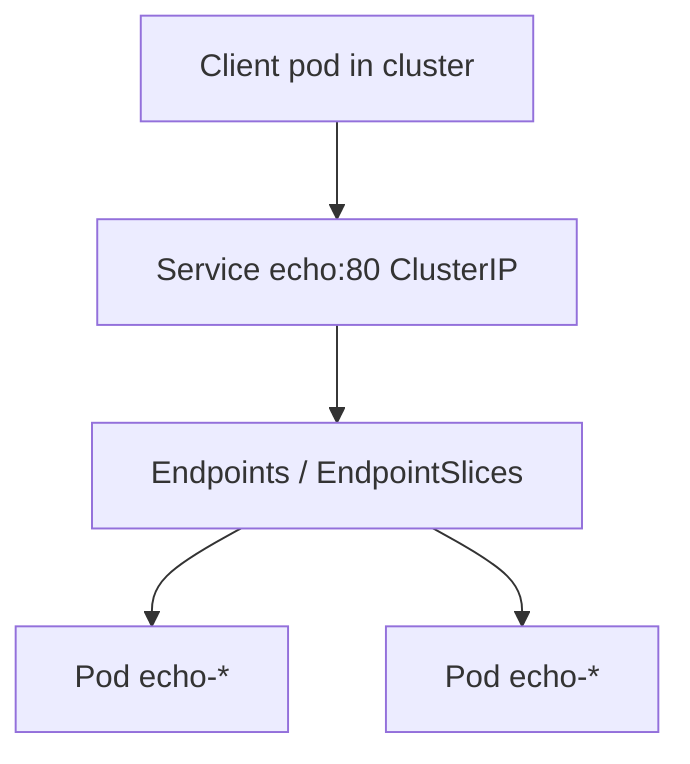

# 2.5.1 Service — teaching transcript

## Metadata

- Duration: ~18 min
- Difficulty: Beginner
- Practical/Theory: 65/35

## Learning objective

By the end of this lesson you will be able to:

- Explain **ClusterIP**: a **virtual IP** and **stable DNS name** that **kube-proxy** (or equivalent datapath) load-balances to **ready** pod IPs.
- Connect **Service `selector` → Endpoints / EndpointSlices → Pod IPs** using `kubectl get`.
- Distinguish **Service port** from **container `targetPort`**.

## Why this matters in real jobs

“Service has no endpoints” is a top incident pattern: selector mismatch, pods not **Ready**, or wrong **namespace**. This lesson makes those checks **muscle memory**.

## Prerequisites

- [Part 2 prerequisites](../../README.md#prerequisites-met-read-this-before-21)
- [2.4.3.1 Deployments](../../2.4-workloads/2.4.3-workload-management/2.4.3.1-deployments/README.md) (pod template + labels)

## Concepts (short theory)

- **ClusterIP** is only reachable **inside the cluster** (unless you add port-forward, Ingress, or Gateway).
- **Readiness** gates endpoints: not-ready pods are not included in load balancing for typical Services.
- **Headless** Services (`clusterIP: None`) behave differently — see [2.4.3.3 StatefulSet](../../2.4-workloads/2.4.3-workload-management/2.4.3.3-statefulsets/README.md); this lesson uses a **normal** ClusterIP.

## Visual — Service to pods



## Lab — Quick Start

**What happens when you run this:**  
`service-clusterip-demo.yaml` creates **`svc-demo`**, a **2-replica** Deployment, and a **ClusterIP** Service selecting `app=echo`. The control plane programs **Endpoints** (and **EndpointSlices**) with the pod IPs once they are **Ready**.

```bash
kubectl apply -f yamls/service-clusterip-demo.yaml
kubectl -n svc-demo rollout status deployment/echo --timeout=180s
kubectl -n svc-demo get svc,deploy,pods,endpoints echo
```

**Optional — hit the Service from a throwaway pod:**

```bash
kubectl run curl-once -n svc-demo --rm -i --restart=Never --image=curlimages/curl:8.5.0 -- \
  curl -sS -o /dev/null -w "%{http_code}\n" http://echo.svc-demo.svc.cluster.local/
# Expect: 200 (then pod exits)
```

**Verify:**

```bash
chmod +x scripts/verify-2-5-1-service-lesson.sh
./scripts/verify-2-5-1-service-lesson.sh
```

## Optional asset (RBAC)

`yamls/2-5-1-service-notes.yaml` installs a **ConfigMap** in **`kube-system`** — only apply if your user may write that namespace (often **denied** on managed clusters). The runnable lab uses **`svc-demo`** only.

## Transcript — short narrative

### Hook

Pods come and go; IPs change. Services give **stable discovery** so ConfigMaps are not full of pod IPs.

### Three kubectl gets

**Say:** `get svc` for the VIP, `get endpoints` (or EndpointSlices) for **real backends**, `get pods` for **why** endpoints might be empty.

### NodePort / LoadBalancer

**Say:** Same selector model; **NodePort** opens a high port on nodes; **LoadBalancer** asks a cloud controller for an external VIP — covered in advanced cloud labs.

## Video close — fast validation

```bash
kubectl -n svc-demo get svc echo -o wide
kubectl -n svc-demo get endpoints echo -o yaml | head -n 40
kubectl get endpointslices -n svc-demo -l kubernetes.io/service-name=echo -o wide 2>/dev/null || true
```

## Repo files (reference)

| Path | Purpose |
|------|---------|
| `yamls/service-clusterip-demo.yaml` | Namespace + Deployment + ClusterIP Service |
| `scripts/verify-2-5-1-service-lesson.sh` | ClusterIP + backend count checks |
| `scripts/inspect-2-5-1-service.sh` | Broad `kubectl get svc` / EndpointSlice listing |
| `yamls/2-5-1-service-notes.yaml` | Optional kube-system notes (RBAC) |
| `yamls/failure-troubleshooting.yaml` | Empty endpoints, wrong types |

## Failure troubleshooting asset

- `yamls/failure-troubleshooting.yaml` — ClusterIP vs NodePort vs LB, empty endpoints.

## Next

[2.5.2 Ingress](../2.5.2-ingress/README.md)
