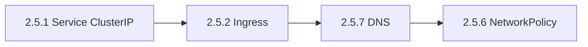

# 2.5 Services, Load Balancing, and Networking

Workloads alone are not reachable: **Services** give stable IPs and DNS, **Ingress / Gateway** expose HTTP routes, **NetworkPolicy** constrains who may talk to whom, and **cluster DNS** ties names together.

**Prerequisites:** [Part 2 entry check](../README.md#prerequisites-met-read-this-before-21); complete [2.4.3.1 Deployments](../2.4-workloads/2.4.3-workload-management/2.4.3.1-deployments/README.md) before Services so **labels and readiness** are familiar.

**Tested-on note:** ClusterIP demo uses `nginx:1.27` in namespace **`svc-demo`** — see [`KUBERNETES_VERSION_MATRIX.md`](../../KUBERNETES_VERSION_MATRIX.md).

## Suggested path (diagram)



## Children

- [2.5.1 Service](2.5.1-service/README.md) — **transcript + `svc-demo` lab + verify**
- [2.5.2 Ingress](2.5.2-ingress/README.md)
- [2.5.3 Ingress Controllers](2.5.3-ingress-controllers/README.md)
- [2.5.4 Gateway API](2.5.4-gateway-api/README.md)
- [2.5.5 EndpointSlices](2.5.5-endpointslices/README.md)
- [2.5.6 Network Policies](2.5.6-network-policies/README.md)
- [2.5.7 DNS for Services and Pods](2.5.7-dns-for-services-and-pods/README.md)
- [2.5.8 IPv4/IPv6 Dual-Stack](2.5.8-ipv4-ipv6-dual-stack/README.md)
- [2.5.9 Topology Aware Routing](2.5.9-topology-aware-routing/README.md)
- [2.5.10 Networking on Windows](2.5.10-networking-on-windows/README.md)
- [2.5.11 Service ClusterIP Allocation](2.5.11-service-clusterip-allocation/README.md)
- [2.5.12 Service Internal Traffic Policy](2.5.12-service-internal-traffic-policy/README.md)

## Module wrap — quick validation

**What happens when you run this:** Read-only snapshot of Services, slices, policies, and DNS pods.

```bash
kubectl get svc,ing -A 2>/dev/null | head -n 40
kubectl get endpointslices -A 2>/dev/null | head -n 20
kubectl get networkpolicy -A 2>/dev/null | head -n 20 || true
kubectl get pods -n kube-system -l k8s-app=kube-dns 2>/dev/null || kubectl get pods -n kube-system | grep -i coredns || true
```

## Next module

[2.6 Storage](../2.6-storage/README.md)
