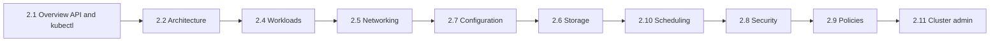

# Part 2: CONCEPTS

Part 2 turns what you installed in [Part 1](../part-1-getting-started/README.md) into a **clear model**: how the control plane and nodes cooperate, how workloads and networking are expressed, and where security and policy hooks sit.

**Format (aligned with Part 1):** Lessons in **2.1**, **2.2**, and **2.3** use a **teaching transcript** style: **What happens when you run this** before runnable blocks, **Expected** outputs, **Video close** recap commands, and `scripts/*.sh` files include a **WHAT THIS DOES WHEN YOU RUN IT** header where scripts exist. Modules **2.4+** are still being brought up to the same standard in follow-on passes.

**Suggested order:** **2.1 → 2.2 → 2.4 → 2.5 → 2.7 → 2.6 → 2.10 → 2.8 → 2.9 → 2.11**, then optional **2.12** (Windows) and **2.13** (extensions) as needed for your role.

## Suggested concept path (diagram)



## Modules

- [2.1 Overview](2.1-overview/README.md)
- [2.2 Cluster Architecture](2.2-cluster-architecture/README.md)
- [2.3 Containers](2.3-containers/README.md)
- [2.4 Workloads](2.4-workloads/README.md)
- [2.5 Services, Load Balancing, and Networking](2.5-services-load-balancing-and-networking/README.md)
- [2.6 Storage](2.6-storage/README.md)
- [2.7 Configuration](2.7-configuration/README.md)
- [2.8 Security](2.8-security/README.md)
- [2.9 Policies](2.9-policies/README.md)
- [2.10 Scheduling, Preemption and Eviction](2.10-scheduling-preemption-and-eviction/README.md)
- [2.11 Cluster Administration](2.11-cluster-administration/README.md)
- [2.12 Windows in Kubernetes](2.12-windows-in-kubernetes/README.md)
- [2.13 Extending Kubernetes](2.13-extending-kubernetes/README.md)

## Part wrap — quick validation

**What happens when you run this:**  
Read-only snapshot of API reachability, core resource types, and namespaces — good smoke test from any machine with `kubectl` configured.

```bash
kubectl cluster-info
kubectl api-resources | head -n 30
kubectl get ns
kubectl get nodes -o wide 2>/dev/null || true
```
